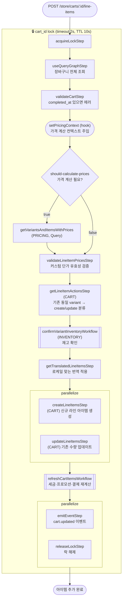

# addToCartWorkflow

사용자가 상품을 장바구니에 담을 때 호출되는 워크플로우. 락 획득 → 가격 계산 → 재고 확인 → 라인 아이템 생성/수량 업데이트 → 세금·프로모션·결제 재계산 → 락 해제.

[← 단계 README](./README.md)

**소스**: [packages/core/core-flows/src/cart/workflows/add-to-cart.ts](../../../../packages/core/core-flows/src/cart/workflows/add-to-cart.ts)
**호출 API**: `POST /store/carts/:id/line-items`

## 입력 / 출력

| 항목 | 타입 | 설명 |
|------|------|------|
| cart_id | string | 장바구니 ID |
| items | `{variant_id, quantity, unit_price?}[]` | 추가할 상품 목록 |
| output | void | (refreshCartItemsWorkflow가 재계산된 Cart 상태를 반영) |

## Flowchart

## Step 설명

| 순번 | Step | 모듈 | 보상(rollback) |
|------|------|------|----------------|
| 1 | `acquireLockStep` | LOCKING | `releaseLockStep` |
| 2 | `useQueryGraphStep` | Query | 없음 |
| 3 | `validateCartStep` | — | 없음 |
| 4 | `setPricingContext` (hook) | — | 없음 |
| 5 | `getVariantsAndItemsWithPrices` | PRICING, Query | 없음 (조건부) |
| 6 | `validateLineItemPricesStep` | — | 없음 |
| 7 | `getLineItemActionsStep` | CART | 없음 |
| 8 | `confirmVariantInventoryWorkflow` | INVENTORY | 없음 |
| 9 | `getTranslatedLineItemsStep` | — | 없음 |
| 10a | `createLineItemsStep` | CART | `service.deleteLineItems(ids)` |
| 10b | `updateLineItemsStep` | CART | 이전 값으로 복원 |
| 11 | `refreshCartItemsWorkflow` | 여러 모듈 | 서브워크플로우 내부 보상 |
| 12a | `emitEventStep` | EVENT_BUS | 없음 |
| 12b | `releaseLockStep` | LOCKING | 없음 |

## 보상(Compensation) 흐름

- **`createLineItemsStep` 실패**: 생성된 라인 아이템 ID에 대해 `service.deleteLineItems(ids)` 실행.
- **`updateLineItemsStep` 실패**: 이전 라인 아이템 상태로 복원.
- 락은 워크플로우 종료 시(성공/실패 모두) `releaseLockStep`으로 해제.

## 호출하는 서브워크플로우

- [refreshCartItemsWorkflow](./flow-refreshCartItemsWorkflow.md) — 세금·프로모션·결제 컬렉션 일괄 재계산
- [confirmVariantInventoryWorkflow](./flow-addToCartWorkflow.md) — 재고 확인 (이 워크플로우 내부 임베드)
