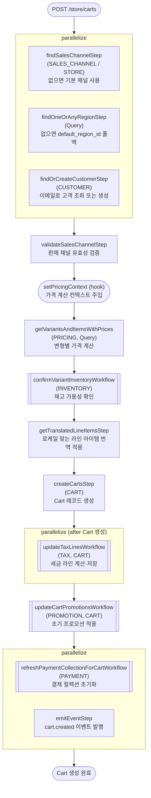

# createCartWorkflow

장바구니를 처음 생성할 때 호출되는 워크플로우. 리전·판매채널·고객 조회, 가격 계산, 재고 확인, Cart 레코드 생성, 세금·프로모션·결제 컬렉션 초기화까지 한 번에 처리한다.

[← 단계 README](./README.md)

**소스**: [packages/core/core-flows/src/cart/workflows/create-carts.ts](../../../../packages/core/core-flows/src/cart/workflows/create-carts.ts)
**호출 API**: `POST /store/carts`

## 입력 / 출력

| 항목 | 타입 | 설명 |
|------|------|------|
| region_id? | string | 리전 ID |
| sales_channel_id? | string | 판매 채널 ID |
| customer_id? / email? | string | 고객 식별 정보 |
| items? | `{variant_id, quantity, unit_price?}[]` | 초기 담을 상품 목록 |
| promo_codes? | string[] | 초기 적용할 프로모션 코드 |
| shipping_address? | AddressDTO | 배송 주소 |
| locale? | string | 번역 로케일 |
| output | CartDTO | 생성된 Cart 객체 |

## Flowchart

## Step 설명

| 순번 | Step | 모듈 | 보상(rollback) |
|------|------|------|----------------|
| 1a | `findSalesChannelStep` | SALES_CHANNEL, STORE | 없음 |
| 1b | `findOneOrAnyRegionStep` | Query | 없음 |
| 1c | `findOrCreateCustomerStep` | CUSTOMER | 없음 |
| 2 | `validateSalesChannelStep` | — | 없음 |
| 3 | `setPricingContext` (hook) | — | 없음 |
| 4 | `getVariantsAndItemsWithPrices` | PRICING, Query | 없음 |
| 5 | `confirmVariantInventoryWorkflow` | INVENTORY | 없음 |
| 6 | `getTranslatedLineItemsStep` | — | 없음 |
| 7 | `createCartsStep` | CART | `service.deleteCarts(ids)` |
| 8 | `updateTaxLinesWorkflow` | TAX, CART | 서브워크플로우 내부 보상 |
| 9 | `updateCartPromotionsWorkflow` | PROMOTION, CART | 서브워크플로우 내부 보상 |
| 10a | `refreshPaymentCollectionForCartWorkflow` | PAYMENT | 서브워크플로우 내부 보상 |
| 10b | `emitEventStep` | EVENT_BUS | 없음 |

## 보상(Compensation) 흐름

- **`createCartsStep` 실패**: 생성된 Cart ID 목록에 대해 `service.deleteCarts(ids)` 자동 실행.
- 1~6번 step은 조회·검증만 하므로 별도 보상 없음.
- 서브워크플로우(updateTaxLines, updateCartPromotions, refreshPaymentCollection)는 각각 내부 보상 로직을 가짐.

## 호출하는 서브워크플로우

- [refreshPaymentCollectionForCartWorkflow](./flow-refreshPaymentCollectionForCartWorkflow.md) — 결제 컬렉션 초기화 (07 폴더에서 상세 설명)
- [updateTaxLinesWorkflow](../06-세금계산/flow-updateTaxLinesWorkflow.md) — 세금 라인 전체 재계산
- [updateCartPromotionsWorkflow](../05-프로모션-적용/flow-updateCartPromotionsWorkflow.md) — 프로모션 적용
- [confirmVariantInventoryWorkflow](./flow-addToCartWorkflow.md) — 재고 확인 (addToCart 내부와 동일)
