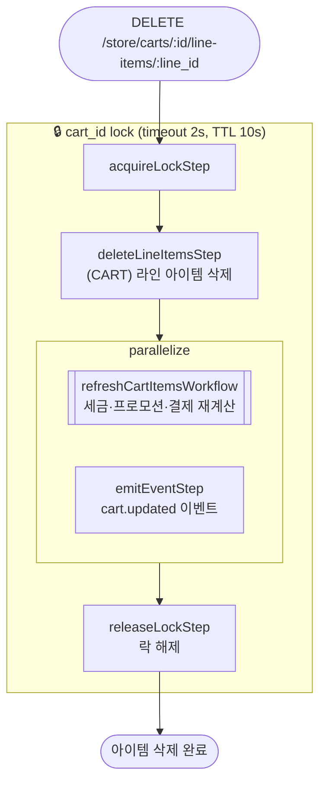

# deleteLineItemsWorkflow

장바구니에서 라인 아이템을 삭제하는 워크플로우. 락 획득 → 라인 아이템 삭제 → 세금·프로모션·결제 재계산 + 이벤트 발행(병렬) → 락 해제.

[← 단계 README](./README.md)

**소스**: [packages/core/core-flows/src/line-item/workflows/delete-line-items.ts](../../../../packages/core/core-flows/src/line-item/workflows/delete-line-items.ts)
**호출 API**: `DELETE /store/carts/:id/line-items/:line_id`

## 입력 / 출력

| 항목 | 타입 | 설명 |
|------|------|------|
| cart_id | string | 장바구니 ID |
| ids | string[] | 삭제할 라인 아이템 ID 목록 |
| output | void | |

## Flowchart

## Step 설명

| 순번 | Step | 모듈 | 보상(rollback) |
|------|------|------|----------------|
| 1 | `acquireLockStep` | LOCKING | `releaseLockStep` |
| 2 | `deleteLineItemsStep` | CART | `service.restoreLineItems(ids)` |
| 3a | `refreshCartItemsWorkflow` | 여러 모듈 | 서브워크플로우 내부 보상 |
| 3b | `emitEventStep` | EVENT_BUS | 없음 |
| 4 | `releaseLockStep` | LOCKING | 없음 |

## 보상(Compensation) 흐름

- **`deleteLineItemsStep` 실패**: 삭제된 라인 아이템 ID에 대해 `service.restoreLineItems(ids)` 실행.
- 락은 성공/실패 무관하게 마지막에 `releaseLockStep`으로 해제.

## 호출하는 서브워크플로우

- [refreshCartItemsWorkflow](./flow-refreshCartItemsWorkflow.md) — 세금·프로모션·결제 컬렉션 일괄 재계산
