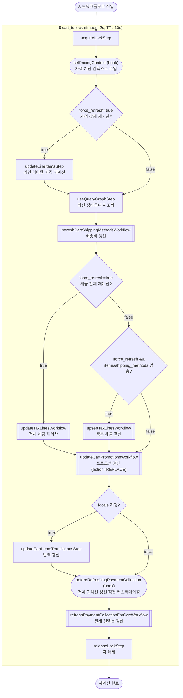

# refreshCartItemsWorkflow

아이템 추가·수정·배송 방법 선택 후 항상 호출되는 공통 재계산 서브워크플로우. 배송비 갱신 → 세금 재계산 → 프로모션 갱신 → 결제 컬렉션 갱신을 순서대로 처리한다.

[← 단계 README](./README.md)

**소스**: [packages/core/core-flows/src/cart/workflows/refresh-cart-items.ts](../../../../packages/core/core-flows/src/cart/workflows/refresh-cart-items.ts)
**호출 API**: 직접 호출되지 않음 (addToCart, updateLineItemInCart, deleteLineItems, addShippingMethod, updateCart 등에서 서브워크플로우로 호출)

## 입력 / 출력

| 항목 | 타입 | 설명 |
|------|------|------|
| cart_id | string | 재계산할 장바구니 ID |
| force_refresh? | boolean | true이면 가격·세금 전체 강제 재계산 |
| locale? | string | 번역 로케일 (번역 갱신 트리거) |
| output | void | |

## Flowchart

## Step 설명

| 순번 | Step / Hook | 조건 | 모듈 | 보상(rollback) |
|------|------------|------|------|----------------|
| 1 | `acquireLockStep` | — | LOCKING | `releaseLockStep` |
| 2 | `setPricingContext` (hook) | — | — | 없음 |
| 3 | `updateLineItemsStep` (가격 재계산) | `force_refresh=true` | CART | 이전 값 복원 |
| 4 | `useQueryGraphStep` (refetch-cart) | — | Query | 없음 |
| 5 | `refreshCartShippingMethodsWorkflow` | — | CART, FULFILLMENT | 서브워크플로우 내부 보상 |
| 6 | `updateTaxLinesWorkflow` | `force_refresh=true` | TAX, CART | 서브워크플로우 내부 보상 |
| 7 | `upsertTaxLinesWorkflow` | `!force_refresh && items/SM 있음` | TAX, CART | 서브워크플로우 내부 보상 |
| 8 | `updateCartPromotionsWorkflow` | — | PROMOTION, CART | 서브워크플로우 내부 보상 |
| 9 | `updateCartItemsTranslationsStep` | `locale` 지정 시 | CART | 없음 |
| 10 | `beforeRefreshingPaymentCollection` (hook) | — | — | 없음 |
| 11 | `refreshPaymentCollectionForCartWorkflow` | — | PAYMENT | 서브워크플로우 내부 보상 |
| 12 | `releaseLockStep` | — | LOCKING | 없음 |

## 보상(Compensation) 흐름

- 각 서브워크플로우(updateTaxLines, upsertTaxLines, updateCartPromotions, refreshPaymentCollection)는 자체 보상 로직을 내부에서 처리.
- 락은 항상 마지막에 `releaseLockStep`으로 해제.

## 호출하는 서브워크플로우

- [updateTaxLinesWorkflow](../06-세금계산/flow-updateTaxLinesWorkflow.md) — 세금 라인 전체 재계산
- [upsertTaxLinesWorkflow](../06-세금계산/flow-upsertTaxLinesWorkflow.md) — 세금 라인 증분 갱신
- [updateCartPromotionsWorkflow](../05-프로모션-적용/flow-updateCartPromotionsWorkflow.md) — 프로모션 재계산
- [refreshPaymentCollectionForCartWorkflow](../07-결제세션-생성/flow-refreshPaymentCollectionForCartWorkflow.md) — 결제 컬렉션 갱신
