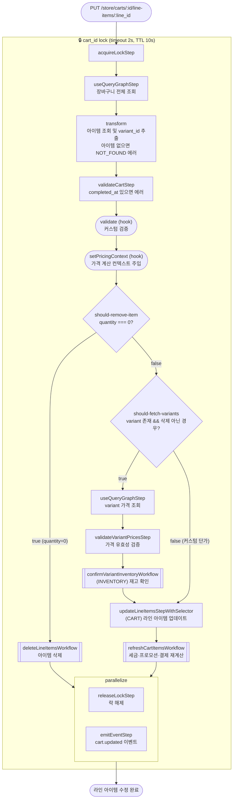

# updateLineItemInCartWorkflow

장바구니의 특정 라인 아이템을 수정(수량·단가 변경)하는 워크플로우. 수량이 0이면 해당 아이템을 삭제로 처리한다.

[← 단계 README](./README.md)

**소스**: [packages/core/core-flows/src/cart/workflows/update-line-item-in-cart.ts](../../../../packages/core/core-flows/src/cart/workflows/update-line-item-in-cart.ts)
**호출 API**: `PUT /store/carts/:id/line-items/:line_id`

## 입력 / 출력

| 항목 | 타입 | 설명 |
|------|------|------|
| cart_id | string | 장바구니 ID |
| item_id | string | 수정할 라인 아이템 ID |
| update.quantity? | number | 새 수량 (0이면 삭제) |
| update.unit_price? | number | 커스텀 단가 |
| output | void | |

## Flowchart

## Step 설명

| 순번 | Step | 모듈 | 보상(rollback) |
|------|------|------|----------------|
| 1 | `acquireLockStep` | LOCKING | `releaseLockStep` |
| 2 | `useQueryGraphStep` | Query | 없음 |
| 3 | `transform` (아이템 조회) | — | 없음 |
| 4 | `validateCartStep` | — | 없음 |
| 5 | `validate` (hook) | — | 없음 |
| 6 | `setPricingContext` (hook) | — | 없음 |
| 7 | `deleteLineItemsWorkflow` | CART, LOCKING | 서브워크플로우 내부 보상 (조건부) |
| 8 | `useQueryGraphStep` (variants) | Query | 없음 (조건부) |
| 9 | `validateVariantPricesStep` | — | 없음 (조건부) |
| 10 | `confirmVariantInventoryWorkflow` | INVENTORY | 없음 (조건부) |
| 11 | `updateLineItemsStepWithSelector` | CART | 이전 값으로 복원 |
| 12 | `refreshCartItemsWorkflow` | 여러 모듈 | 서브워크플로우 내부 보상 |
| 13a | `releaseLockStep` | LOCKING | 없음 |
| 13b | `emitEventStep` | EVENT_BUS | 없음 |

## 보상(Compensation) 흐름

- **수량 0 분기**: `deleteLineItemsWorkflow`가 자체 보상 로직 처리.
- **`updateLineItemsStepWithSelector` 실패**: CART 모듈이 이전 라인 아이템 상태로 복원.
- 락은 성공/실패 무관하게 `releaseLockStep`으로 해제.

## 호출하는 서브워크플로우

- [deleteLineItemsWorkflow](./flow-deleteLineItemsWorkflow.md) — 수량 0일 때 아이템 삭제 처리
- [refreshCartItemsWorkflow](./flow-refreshCartItemsWorkflow.md) — 세금·프로모션·결제 컬렉션 재계산
- [confirmVariantInventoryWorkflow](./flow-addToCartWorkflow.md) — 재고 확인
