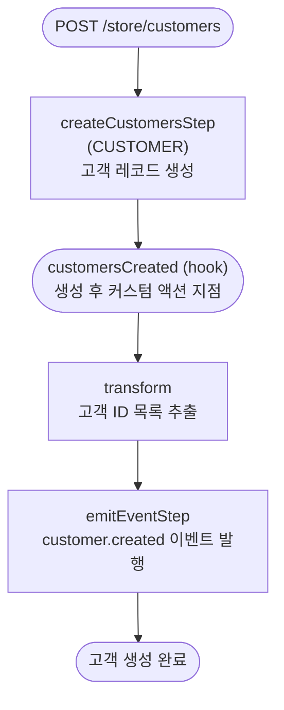

# createCustomerWorkflow

비로그인 사용자가 신규 고객으로 가입할 때 호출되는 워크플로우. 고객 레코드 생성 → hook 실행 → 이벤트 발행.

[← 단계 README](./README.md)

**소스**: [packages/core/core-flows/src/customer/workflows/create-customers.ts](../../../../packages/core/core-flows/src/customer/workflows/create-customers.ts)
**호출 API**: `POST /store/customers`

## 입력 / 출력

| 항목 | 타입 | 설명 |
|------|------|------|
| customersData | `CreateCustomerDTO[]` | 생성할 고객 정보 배열 |
| output | `CustomerDTO[]` | 생성된 고객 객체 배열 |

## Flowchart

## Step 설명

| 순번 | Step | 모듈 | 보상(rollback) |
|------|------|------|----------------|
| 1 | `createCustomersStep` | CUSTOMER | `service.deleteCustomers(ids)` |
| 2 | `customersCreated` (hook) | — | 없음 |
| 3 | `transform` (ID 추출) | — | 없음 |
| 4 | `emitEventStep` | EVENT_BUS | 없음 |

## 보상(Compensation) 흐름

- **`createCustomersStep` 실패**: 생성된 고객 ID에 대해 `service.deleteCustomers(ids)` 자동 실행.

## 호출하는 서브워크플로우

없음.
