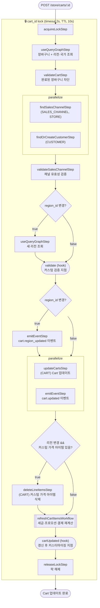

# updateCartWorkflow

장바구니에 고객 정보·주소·리전 등을 업데이트하는 워크플로우. 리전 변경 시 커스텀 가격 아이템을 삭제하고, 세금·프로모션·결제 컬렉션을 재계산한다.

[← 단계 README](./README.md)

**소스**: [packages/core/core-flows/src/cart/workflows/update-cart.ts](../../../../packages/core/core-flows/src/cart/workflows/update-cart.ts)
**호출 API**: `POST /store/carts/:id`

## 입력 / 출력

| 항목 | 타입 | 설명 |
|------|------|------|
| id | string | 장바구니 ID |
| region_id? | string | 새 리전 ID |
| email? | string | 고객 이메일 |
| customer_id? | string | 로그인된 고객 ID |
| shipping_address? | AddressDTO | 배송 주소 |
| billing_address? | AddressDTO | 청구 주소 |
| sales_channel_id? | string | 판매 채널 ID |
| promo_codes? | string[] | 프로모션 코드 |
| output | void | |

## Flowchart

## Step 설명

| 순번 | Step | 모듈 | 보상(rollback) |
|------|------|------|----------------|
| 1 | `acquireLockStep` | LOCKING | `releaseLockStep` |
| 2 | `useQueryGraphStep` | Query | 없음 |
| 3 | `validateCartStep` | — | 없음 |
| 4a | `findSalesChannelStep` | SALES_CHANNEL, STORE | 없음 |
| 4b | `findOrCreateCustomerStep` | CUSTOMER | 없음 |
| 5 | `validateSalesChannelStep` | — | 없음 |
| 6 | `useQueryGraphStep` (새 리전) | Query | 없음 (조건부) |
| 7 | `validate` (hook) | — | 없음 |
| 8 | `emitEventStep` (region_updated) | EVENT_BUS | 없음 (조건부) |
| 9a | `updateCartsStep` | CART | 이전 Cart 상태로 복원 |
| 9b | `emitEventStep` (cart.updated) | EVENT_BUS | 없음 |
| 10 | `deleteLineItemsStep` | CART | `restoreLineItems(ids)` (조건부) |
| 11 | `refreshCartItemsWorkflow` | 여러 모듈 | 서브워크플로우 내부 보상 |
| 12 | `cartUpdated` (hook) | — | 없음 |
| 13 | `releaseLockStep` | LOCKING | 없음 |

## 보상(Compensation) 흐름

- **`updateCartsStep` 실패**: 이전 Cart 데이터로 복원.
- **`deleteLineItemsStep` 실패**: `restoreLineItems(ids)`로 삭제된 아이템 복원.
- 락은 항상 마지막에 `releaseLockStep`으로 해제.

### 주소 처리 규칙

- `shipping_address.country_code`가 새 리전의 국가 목록에 없으면 `INVALID_DATA` 에러.
- 리전이 변경되고 국가가 1개이면 해당 `country_code` 자동 설정.
- 리전이 변경되고 `country_code` 없으면 `shipping_address = null`로 초기화.

## 호출하는 서브워크플로우

- [refreshCartItemsWorkflow](./flow-refreshCartItemsWorkflow.md) — 세금·프로모션·결제 컬렉션 일괄 재계산
