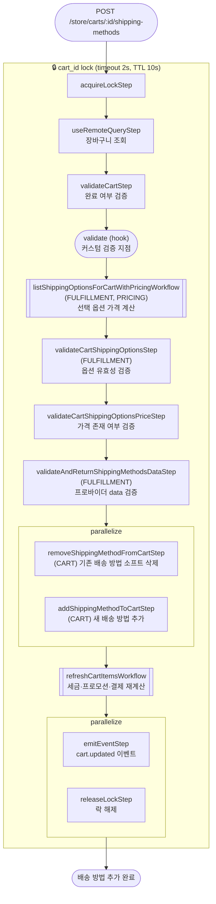

# addShippingMethodToCartWorkflow

사용자가 배송 방법을 선택할 때 호출되는 워크플로우. 기존 배송 방법을 소프트 삭제하고 새 배송 방법을 추가한 뒤 세금·프로모션·결제 컬렉션을 재계산한다.

[← 단계 README](./README.md)

**소스**: [packages/core/core-flows/src/cart/workflows/add-shipping-method-to-cart.ts](../../../../packages/core/core-flows/src/cart/workflows/add-shipping-method-to-cart.ts)
**호출 API**: `POST /store/carts/:id/shipping-methods`

## 입력 / 출력

| 항목 | 타입 | 설명 |
|------|------|------|
| cart_id | string | 장바구니 ID |
| options | `{id, data?}[]` | 선택된 배송 옵션 ID 및 프로바이더 추가 데이터 |
| output | void | |

## Flowchart

### 가격 타입별 처리 (flat vs calculated)

`listShippingOptionsForCartWithPricingWorkflow` 내부 분기:

| 타입 | 처리 방식 |
|------|----------|
| `flat` | Pricing 모듈 PriceSet → `calculated_price` 직접 조회 |
| `calculated` | `calculateShippingOptionsPricesStep` → FULFILLMENT 프로바이더 가격 계산 API 호출 |

## Step 설명

| 순번 | Step | 모듈 | 보상(rollback) |
|------|------|------|----------------|
| 1 | `acquireLockStep` | LOCKING | `releaseLockStep` |
| 2 | `useRemoteQueryStep` | Remote Query | 없음 |
| 3 | `validateCartStep` | — | 없음 |
| 4 | `validate` (hook) | — | 없음 |
| 5 | `listShippingOptionsForCartWithPricingWorkflow` | FULFILLMENT, PRICING | 없음 (read-only) |
| 6 | `validateCartShippingOptionsStep` | FULFILLMENT | 없음 |
| 7 | `validateCartShippingOptionsPriceStep` | — | 없음 |
| 8 | `validateAndReturnShippingMethodsDataStep` | FULFILLMENT | 없음 |
| 9a | `removeShippingMethodFromCartStep` | CART | 소프트 삭제된 배송 방법 복원 |
| 9b | `addShippingMethodToCartStep` | CART | `service.deleteShippingMethods(ids)` |
| 10 | `refreshCartItemsWorkflow` | 여러 모듈 | 서브워크플로우 내부 보상 |
| 11a | `emitEventStep` | EVENT_BUS | 없음 |
| 11b | `releaseLockStep` | LOCKING | 없음 |

## 보상(Compensation) 흐름

- **`addShippingMethodToCartStep` 실패**: 추가된 배송 방법 삭제.
- **`removeShippingMethodFromCartStep` 실패**: 소프트 삭제된 기존 배송 방법 복원.
- 기존 배송 방법은 소프트 삭제이므로 보상 시 복원 가능 (분할 배송 미지원 설계).
- 락은 항상 `releaseLockStep`으로 해제.

## 호출하는 서브워크플로우

- [refreshCartItemsWorkflow](./flow-refreshCartItemsWorkflow.md) — 세금·프로모션·결제 컬렉션 일괄 재계산
