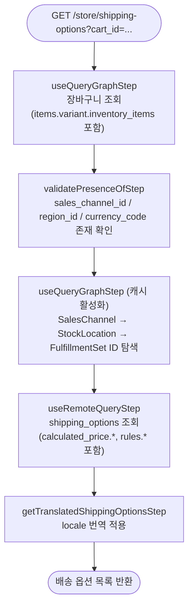

# listShippingOptionsForCartWorkflow

장바구니에 적용 가능한 배송 옵션 목록을 조회하는 워크플로우. 채널 → 재고 위치 → 풀필먼트 세트 경로로 배송 옵션을 탐색하고, 가격 계산 및 재고 부족 여부를 함께 반환한다.

[← 단계 README](./README.md)

**소스**: [packages/core/core-flows/src/cart/workflows/list-shipping-options-for-cart.ts](../../../../packages/core/core-flows/src/cart/workflows/list-shipping-options-for-cart.ts)
**호출 API**: `GET /store/shipping-options`

## 입력 / 출력

| 항목 | 타입 | 설명 |
|------|------|------|
| cart_id | string | 장바구니 ID |
| is_return? | boolean | 반품용 배송 옵션 조회 여부 |
| output | `ShippingOptionDTO[]` | 가격·가용성이 계산된 배송 옵션 목록 |

## Flowchart



### 조회 필터 구성

```
fulfillment_set_id: SalesChannel → StockLocation → FulfillmentSet 경로 추출
address:           cart.shipping_address (country_code, province, city, postal_code) → GeoZone 매칭
calculated_price.context: { currency_code, region_id, customer_id }
```

## Step 설명

| 순번 | Step | 모듈 | 보상(rollback) |
|------|------|------|----------------|
| 1 | `useQueryGraphStep` (cart) | Query | 없음 |
| 2 | `validatePresenceOfStep` | — | 없음 |
| 3 | `useQueryGraphStep` (FulfillmentSet 탐색) | Query | 없음 |
| 4 | `useRemoteQueryStep` (shipping_options) | Remote Query | 없음 |
| 5 | `getTranslatedShippingOptionsStep` | — | 없음 |

## 보상(Compensation) 흐름

read-only 워크플로우이므로 보상 동작 없음.

## 호출하는 서브워크플로우

없음. (가격 계산은 `useRemoteQueryStep` 내부에서 Pricing 모듈이 처리)
