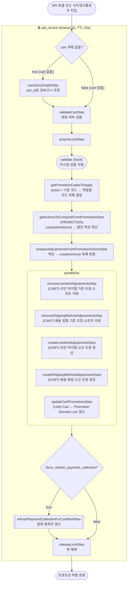

# updateCartPromotionsWorkflow

장바구니에 프로모션 코드를 추가·제거·교체하는 워크플로우. `computeActions()`로 할인 액션을 계산한 뒤 LineItemAdjustment와 ShippingMethodAdjustment를 병렬로 갱신한다.

[← 단계 README](./README.md)

**소스**: [packages/core/core-flows/src/cart/workflows/update-cart-promotions.ts](../../../../packages/core/core-flows/src/cart/workflows/update-cart-promotions.ts)
**호출 API**: `POST /store/carts/:id/promotions` (ADD) / `DELETE /store/carts/:id/promotions` (REMOVE)

## 입력 / 출력

| 항목 | 타입 | 설명 |
|------|------|------|
| cart_id | string | 장바구니 ID |
| promo_codes | string[] | 적용할 프로모션 코드 목록 |
| action | `ADD \| REMOVE \| REPLACE` | 코드 적용 방식 |
| cart? | CartDTO | 이미 조회된 Cart 객체 (없으면 내부에서 조회) |
| output | void | |

### action 종류

| action | 의미 |
|--------|------|
| `ADD` | 기존 코드 유지 + 신규 코드 추가 |
| `REMOVE` | 기존 코드에서 해당 코드 제거 |
| `REPLACE` | 기존 코드 전부 제거 후 신규 코드로 대체 (refreshCartItemsWorkflow 내부 호출 시) |

## Flowchart

## Step 설명

| 순번 | Step | 모듈 | 보상(rollback) |
|------|------|------|----------------|
| 1 | `useQueryGraphStep` (조건부) | Query | 없음 |
| 2 | `validateCartStep` | — | 없음 |
| 3 | `acquireLockStep` | LOCKING | `releaseLockStep` |
| 4 | `validate` (hook) | — | 없음 |
| 5 | `getPromotionCodesToApply` | — | 없음 |
| 6 | `getActionsToComputeFromPromotionsStep` | PROMOTION | 없음 |
| 7 | `prepareAdjustmentsFromPromotionActionsStep` | — | 없음 |
| 8a | `removeLineItemAdjustmentsStep` | CART | 소프트 삭제 복원 |
| 8b | `removeShippingMethodAdjustmentsStep` | CART | 소프트 삭제 복원 |
| 8c | `createLineItemAdjustmentsStep` | CART | 생성된 조정 삭제 |
| 8d | `createShippingMethodAdjustmentsStep` | CART | 생성된 조정 삭제 |
| 8e | `updateCartPromotionsStep` | Link | Remote Link 이전 상태 복원 |
| 9 | `refreshPaymentCollectionForCartWorkflow` | PAYMENT | 서브워크플로우 내부 보상 (조건부) |
| 10 | `releaseLockStep` | LOCKING | 없음 |

## 보상(Compensation) 흐름

- **createLineItem/ShippingMethodAdjustmentsStep 실패**: 생성된 조정 항목 삭제.
- **removeLineItem/ShippingMethodAdjustmentsStep 실패**: 소프트 삭제된 조정 항목 복원.
- **`updateCartPromotionsStep` 실패**: Cart ↔ Promotion Remote Link 이전 상태로 복원.
- 락은 항상 마지막에 `releaseLockStep`으로 해제.

## 호출하는 서브워크플로우

- [refreshPaymentCollectionForCartWorkflow](../07-결제세션-생성/flow-refreshPaymentCollectionForCartWorkflow.md) — 결제 컬렉션 갱신 (조건부)
