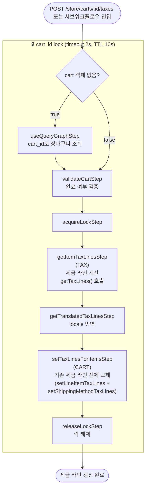

# updateTaxLinesWorkflow

장바구니의 모든 라인 아이템과 배송 방법에 대한 세금 라인을 전체 덮어쓰는 워크플로우. `refreshCartItemsWorkflow`에서 `force_refresh=true`일 때, 또는 `POST /store/carts/:id/taxes` 호출 시 실행된다.

[← 단계 README](./README.md)

**소스**: [packages/core/core-flows/src/cart/workflows/update-tax-lines.ts](../../../../packages/core/core-flows/src/cart/workflows/update-tax-lines.ts)
**호출 API**: `POST /store/carts/:id/taxes` (또는 refreshCartItemsWorkflow 서브워크플로우)

## 입력 / 출력

| 항목 | 타입 | 설명 |
|------|------|------|
| cart_id | string | 세금을 계산할 장바구니 ID |
| cart? | CartDTO | 이미 조회된 Cart 객체 (없으면 내부에서 조회) |
| output | void | |

## Flowchart

### getItemTaxLinesStep 스킵 조건

- `force_tax_calculation=false` && `region.automatic_taxes=false` → 계산 스킵
- `shipping_address.country_code` 없음 → 계산 스킵
- `is_giftcard=true` 아이템 → 세금 미적용

## Step 설명

| 순번 | Step | 모듈 | 보상(rollback) |
|------|------|------|----------------|
| 1 | `useQueryGraphStep` (조건부) | Query | 없음 |
| 2 | `validateCartStep` | — | 없음 |
| 3 | `acquireLockStep` | LOCKING | `releaseLockStep` |
| 4 | `getItemTaxLinesStep` | TAX | 없음 |
| 5 | `getTranslatedTaxLinesStep` | — | 없음 |
| 6 | `setTaxLinesForItemsStep` | CART | 이전 세금 라인으로 복원 |
| 7 | `releaseLockStep` | LOCKING | 없음 |

## 보상(Compensation) 흐름

- **`setTaxLinesForItemsStep` 실패**: CART 모듈이 이전 세금 라인 상태로 복원.
- 락은 항상 마지막에 `releaseLockStep`으로 해제.

## 호출하는 서브워크플로우

없음.
