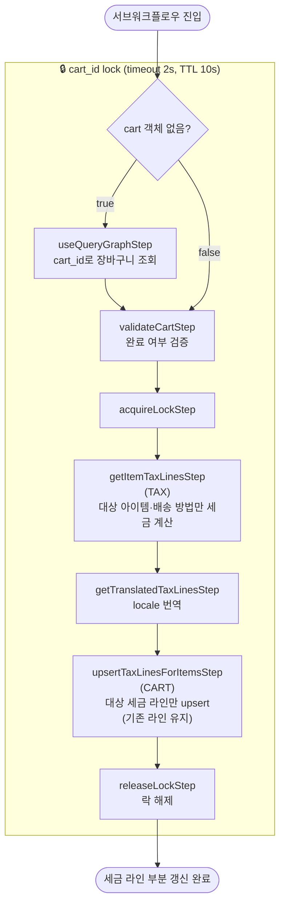

# upsertTaxLinesWorkflow

지정된 라인 아이템·배송 방법의 세금 라인만 upsert하는 워크플로우. `refreshCartItemsWorkflow`에서 `force_refresh=false`이고 갱신 대상 아이템 또는 배송 방법이 있을 때 실행된다. 기존 세금 라인은 유지하고 대상만 갱신한다.

[← 단계 README](./README.md)

**소스**: [packages/core/core-flows/src/cart/workflows/upsert-tax-lines.ts](../../../../packages/core/core-flows/src/cart/workflows/upsert-tax-lines.ts)
**호출 API**: 직접 호출되지 않음 (refreshCartItemsWorkflow 서브워크플로우)

## 입력 / 출력

| 항목 | 타입 | 설명 |
|------|------|------|
| cart_id | string | 세금을 계산할 장바구니 ID |
| items? | LineItemDTO[] | 세금 갱신 대상 라인 아이템 |
| shipping_methods? | ShippingMethodDTO[] | 세금 갱신 대상 배송 방법 |
| cart? | CartDTO | 이미 조회된 Cart 객체 |
| output | void | |

## Flowchart

### updateTaxLinesWorkflow와의 차이

| 구분 | updateTaxLinesWorkflow | upsertTaxLinesWorkflow |
|------|----------------------|----------------------|
| 적용 범위 | 전체 라인 아이템 + 배송 방법 | 지정된 아이템 + 배송 방법만 |
| 갱신 방식 | 기존 세금 라인 전체 교체 (`set`) | 대상만 upsert (기존 유지) |
| 사용 Step | `setTaxLinesForItemsStep` | `upsertTaxLinesForItemsStep` |
| 트리거 | `force_refresh=true` | `force_refresh=false && items/SM 있음` |

## Step 설명

| 순번 | Step | 모듈 | 보상(rollback) |
|------|------|------|----------------|
| 1 | `useQueryGraphStep` (조건부) | Query | 없음 |
| 2 | `validateCartStep` | — | 없음 |
| 3 | `acquireLockStep` | LOCKING | `releaseLockStep` |
| 4 | `getItemTaxLinesStep` | TAX | 없음 |
| 5 | `getTranslatedTaxLinesStep` | — | 없음 |
| 6 | `upsertTaxLinesForItemsStep` | CART | 이전 세금 라인 상태로 복원 |
| 7 | `releaseLockStep` | LOCKING | 없음 |

## 보상(Compensation) 흐름

- **`upsertTaxLinesForItemsStep` 실패**: CART 모듈이 이전 세금 라인 상태로 복원.
- 락은 항상 마지막에 `releaseLockStep`으로 해제.

## 호출하는 서브워크플로우

없음.
