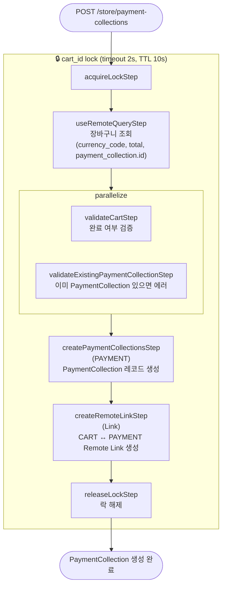

# createPaymentCollectionForCartWorkflow

장바구니에 연결된 PaymentCollection을 생성하는 워크플로우. 장바구니당 1개만 존재하며, API 핸들러에서 이미 존재하는지 확인 후 없을 때만 실행된다.

[← 단계 README](./README.md)

**소스**: [packages/core/core-flows/src/cart/workflows/create-payment-collection-for-cart.ts](../../../../packages/core/core-flows/src/cart/workflows/create-payment-collection-for-cart.ts)
**호출 API**: `POST /store/payment-collections`

## 입력 / 출력

| 항목 | 타입 | 설명 |
|------|------|------|
| cart_id | string | 장바구니 ID |
| output | PaymentCollectionDTO | 생성된 PaymentCollection |

## Flowchart

## Step 설명

| 순번 | Step | 모듈 | 보상(rollback) |
|------|------|------|----------------|
| 1 | `acquireLockStep` | LOCKING | `releaseLockStep` |
| 2 | `useRemoteQueryStep` | Remote Query | 없음 |
| 3a | `validateCartStep` | — | 없음 |
| 3b | `validateExistingPaymentCollectionStep` | — | 없음 |
| 4 | `createPaymentCollectionsStep` | PAYMENT | `service.deletePaymentCollections(ids)` |
| 5 | `createRemoteLinkStep` | Link | Remote Link 삭제 |
| 6 | `releaseLockStep` | LOCKING | 없음 |

## 보상(Compensation) 흐름

- **`createPaymentCollectionsStep` 실패**: 생성된 PaymentCollection ID 삭제.
- **`createRemoteLinkStep` 실패**: CART ↔ PAYMENT Remote Link 삭제.
- 락은 항상 마지막에 `releaseLockStep`으로 해제.

## 호출하는 서브워크플로우

없음.
