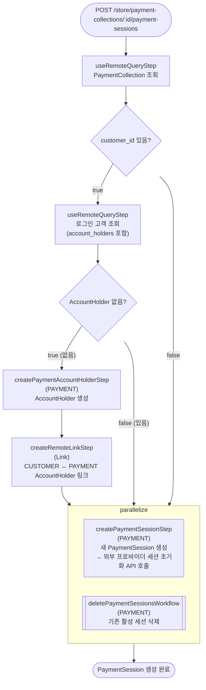

# createPaymentSessionsWorkflow

결제 수단(프로바이더)을 선택하고 외부 결제 프로바이더의 세션을 초기화하는 워크플로우. 기존 활성 세션을 삭제하고 새 세션을 생성한다.

[← 단계 README](./README.md)

**소스**: [packages/core/core-flows/src/payment-collection/workflows/create-payment-session.ts](../../../../packages/core/core-flows/src/payment-collection/workflows/create-payment-session.ts)
**호출 API**: `POST /store/payment-collections/:id/payment-sessions`

## 입력 / 출력

| 항목 | 타입 | 설명 |
|------|------|------|
| payment_collection_id | string | PaymentCollection ID |
| provider_id | string | 결제 프로바이더 ID |
| customer_id? | string | 로그인된 고객 ID |
| data? | Record | 프로바이더에게 전달할 추가 데이터 |
| output | PaymentSessionDTO | 생성된 PaymentSession |

## Flowchart



### createPaymentSessionStep 내부 동작

```
paymentModule.createPaymentSession(payment_collection_id, {
  provider_id,
  amount,
  currency_code,
  data,
  context,
}) → 외부 결제 프로바이더 세션 초기화 API 호출
```

## Step 설명

| 순번 | Step | 모듈 | 보상(rollback) |
|------|------|------|----------------|
| 1 | `useRemoteQueryStep` (PaymentCollection) | Remote Query | 없음 |
| 2 | `useRemoteQueryStep` (Customer) | Remote Query | 없음 (조건부) |
| 3 | `createPaymentAccountHolderStep` | PAYMENT | AccountHolder 삭제 (조건부) |
| 4 | `createRemoteLinkStep` | Link | Remote Link 삭제 (조건부) |
| 5a | `createPaymentSessionStep` | PAYMENT | `service.deletePaymentSessions(ids)` |
| 5b | `deletePaymentSessionsWorkflow` | PAYMENT | 삭제된 세션 복원 (조건부) |

## 보상(Compensation) 흐름

- **`createPaymentSessionStep` 실패**: 생성된 PaymentSession 삭제.
- 기존 세션 삭제(`deletePaymentSessionsWorkflow`)와 신규 생성이 병렬이므로, 실패 시 보상으로 기존 세션을 복원한다.
- 분할 결제 미지원: 기존 세션은 항상 새 세션 생성과 동시에 삭제된다.

## 호출하는 서브워크플로우

- `deletePaymentSessionsWorkflow` — 기존 활성 PaymentSession 삭제
