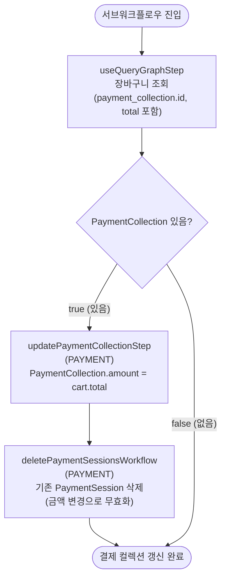

# refreshPaymentCollectionForCartWorkflow

장바구니 총액 변경 후 PaymentCollection의 amount를 현재 Cart total에 맞게 갱신하는 서브워크플로우. 아이템 추가·삭제·배송 방법 변경 등 Cart 상태가 바뀔 때마다 호출된다.

[← 단계 README](./README.md)

**소스**: [packages/core/core-flows/src/cart/workflows/refresh-payment-collection.ts](../../../../packages/core/core-flows/src/cart/workflows/refresh-payment-collection.ts)
**호출 API**: 직접 호출되지 않음 (createCartWorkflow, refreshCartItemsWorkflow, updateCartPromotionsWorkflow 등에서 서브워크플로우로 호출)

## 입력 / 출력

| 항목 | 타입 | 설명 |
|------|------|------|
| cart_id | string | 장바구니 ID |
| output | void | |

## Flowchart

## Step 설명

| 순번 | Step | 모듈 | 보상(rollback) |
|------|------|------|----------------|
| 1 | `useQueryGraphStep` | Query | 없음 |
| 2 | `updatePaymentCollectionStep` | PAYMENT | 이전 amount로 복원 (조건부) |
| 3 | `deletePaymentSessionsWorkflow` | PAYMENT | 삭제된 세션 복원 (조건부) |

## 보상(Compensation) 흐름

- **`updatePaymentCollectionStep` 실패**: PaymentCollection amount를 이전 값으로 복원.
- 금액이 변경되면 기존 PaymentSession은 무효화되어 삭제된다. 새 세션은 사용자가 다시 `createPaymentSessionsWorkflow`를 호출하여 생성한다.

## 호출하는 서브워크플로우

없음.
