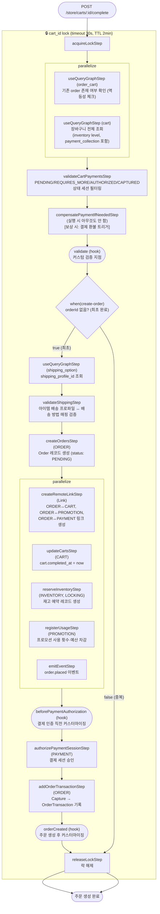

# completeCartWorkflow

사용자가 "결제하기"를 누를 때 호출되는 워크플로우. Cart → Order 변환, 재고 예약, 프로모션 사용량 등록, 결제 승인을 하나의 트랜잭션에서 처리한다. 멱등성을 보장하여 동일 cart_id 중복 호출 시 기존 order_id를 반환한다.

[← 단계 README](./README.md)

**소스**: [packages/core/core-flows/src/cart/workflows/complete-cart.ts](../../../../packages/core/core-flows/src/cart/workflows/complete-cart.ts)
**호출 API**: `POST /store/carts/:id/complete`

## 입력 / 출력

| 항목 | 타입 | 설명 |
|------|------|------|
| id | string | 장바구니 ID |
| output | `{ order_id }` | 생성된 Order ID |

## Flowchart

### authorizePaymentSessionStep 결과 분기

| 결과 | HTTP 응답 | 처리 |
|------|-----------|------|
| `AUTHORIZED` | 200 `{ order }` | 정상 완료 |
| `REQUIRES_MORE` | 200 `{ cart, error }` | 3DS 추가 인증 필요 |
| 그 외 / Payment 없음 | 200 `{ cart, error }` | 결제 실패 |

## Step 설명

| 순번 | Step | 모듈 | 보상(rollback) |
|------|------|------|----------------|
| 1 | `acquireLockStep` | LOCKING | `releaseLockStep` |
| 2a | `useQueryGraphStep` (order_cart) | Query | 없음 |
| 2b | `useQueryGraphStep` (cart) | Query | 없음 |
| 3 | `validateCartPaymentsStep` | — | 없음 |
| 4 | `compensatePaymentIfNeededStep` | PAYMENT | **보상 시**: `paymentModule.refundPayment()` |
| 5 | `validate` (hook) | — | 없음 |
| 6 | `useQueryGraphStep` (shipping_option) | Query | 없음 (조건부) |
| 7 | `validateShippingStep` | — | 없음 (조건부) |
| 8 | `createOrdersStep` | ORDER | `service.deleteOrders(ids)` |
| 9 | `createRemoteLinkStep` | Link | Remote Link 삭제 |
| 10 | `updateCartsStep` | CART | `completed_at = null` 복원 |
| 11 | `reserveInventoryStep` | INVENTORY, LOCKING | `deleteReservationItems(ids)` |
| 12 | `registerUsageStep` | PROMOTION | 사용량 롤백 |
| 13 | `emitEventStep` | EVENT_BUS | 없음 |
| 14 | `beforePaymentAuthorization` (hook) | — | 없음 |
| 15 | `authorizePaymentSessionStep` | PAYMENT | `paymentModule.cancelPayment(id)` |
| 16 | `addOrderTransactionStep` | ORDER | OrderTransaction 삭제 |
| 17 | `orderCreated` (hook) | — | 없음 |
| 18 | `releaseLockStep` | LOCKING | 없음 |

## 보상(Compensation) 흐름

- **`createOrdersStep` 실패**: 생성된 Order 삭제.
- **`reserveInventoryStep` 실패**: `deleteReservationItems(ids)`로 재고 예약 취소.
- **`authorizePaymentSessionStep` 실패**: `REQUIRES_MORE` 상태면 취소 없이 유지. 나머지는 `cancelPayment()`.
- **`compensatePaymentIfNeededStep`**: 워크플로우 어느 단계에서든 실패하면 보상 트리거로 결제 환불 실행.
- 락은 항상 마지막에 `releaseLockStep`으로 해제 (timeout 30s, TTL 2min).

## 호출하는 서브워크플로우

없음 (모든 step이 직접 포함).
