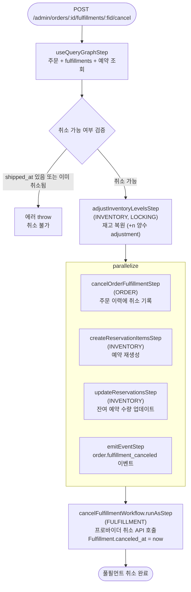

# cancelOrderFulfillmentWorkflow

배송 시작 전 풀필먼트를 취소하는 워크플로우. 차감된 재고를 복원하고 예약을 재생성한다.

[← 단계 README](./README.md)

**소스**: [packages/core/core-flows/src/order/workflows/cancel-order-fulfillment.ts](../../../../packages/core/core-flows/src/order/workflows/cancel-order-fulfillment.ts)
**호출 API**: `POST /admin/orders/:id/fulfillments/:fulfillment_id/cancel`

## 입력 / 출력

| 항목 | 타입 | 설명 |
|------|------|------|
| order_id | string | 주문 ID |
| fulfillment_id | string | 취소할 Fulfillment ID |
| output | void | |

## Flowchart

### 취소 불가 조건

| 조건 | 결과 |
|------|------|
| `shipped_at`이 이미 있음 | 취소 불가 에러 |
| `canceled_at`이 이미 있음 | 취소 불가 에러 |

## Step 설명

| 순번 | Step | 모듈 | 보상(rollback) |
|------|------|------|----------------|
| 1 | `useQueryGraphStep` | Query | 없음 |
| 2 | 검증 (transform) | — | 없음 |
| 3 | `adjustInventoryLevelsStep` | INVENTORY, LOCKING | 복원량 재차감 |
| 4a | `cancelOrderFulfillmentStep` | ORDER | 취소 기록 롤백 |
| 4b | `createReservationItemsStep` | INVENTORY | 재생성된 예약 삭제 |
| 4c | `updateReservationsStep` | INVENTORY | 수량 복원 |
| 4d | `emitEventStep` | EVENT_BUS | 없음 |
| 5 | `cancelFulfillmentWorkflow.runAsStep` | FULFILLMENT | 취소 복원 (가능한 경우) |

## 보상(Compensation) 흐름

- **`adjustInventoryLevelsStep` 실패**: 복원한 재고를 다시 차감하여 원래 상태로 되돌림.
- **`createReservationItemsStep` 실패**: 재생성된 예약 삭제.

## 호출하는 서브워크플로우

없음 (cancelFulfillmentWorkflow는 runAsStep으로 인라인 실행).
