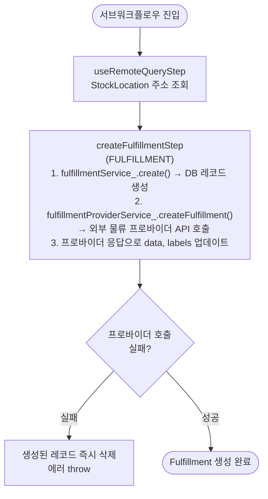

# createFulfillmentWorkflow

Fulfillment 레코드를 DB에 생성하고 외부 물류 프로바이더 API를 호출하는 서브워크플로우. `createOrderFulfillmentWorkflow`에서 호출된다.

[← 단계 README](./README.md)

**소스**: [packages/core/core-flows/src/fulfillment/workflows/create-fulfillment.ts](../../../../packages/core/core-flows/src/fulfillment/workflows/create-fulfillment.ts)
**호출 API**: 직접 호출되지 않음 (createOrderFulfillmentWorkflow에서 서브워크플로우로 호출)

## 입력 / 출력

| 항목 | 타입 | 설명 |
|------|------|------|
| input | CreateFulfillmentDTO | 풀필먼트 생성 데이터 |
| output | FulfillmentDTO | 생성된 Fulfillment 객체 |

## Flowchart

## Step 설명

| 순번 | Step | 모듈 | 보상(rollback) |
|------|------|------|----------------|
| 1 | `useRemoteQueryStep` | Remote Query | 없음 |
| 2 | `createFulfillmentStep` | FULFILLMENT | 프로바이더 실패 시 레코드 즉시 삭제 |

## 보상(Compensation) 흐름

- **외부 프로바이더 호출 실패**: `createFulfillmentStep` 내부에서 즉시 생성된 Fulfillment 레코드를 삭제하고 에러를 throw.
- 워크플로우 레벨 보상은 부모 워크플로우(`createOrderFulfillmentWorkflow`)에서 처리.

## 호출하는 서브워크플로우

없음.
