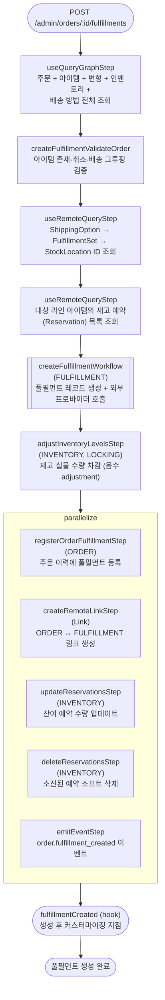

# createOrderFulfillmentWorkflow

관리자가 주문을 발송 준비(풀필먼트 생성)할 때 호출되는 워크플로우. 재고 수량을 차감하고 외부 물류 프로바이더에 풀필먼트를 등록한다.

[← 단계 README](./README.md)

**소스**: [packages/core/core-flows/src/order/workflows/create-fulfillment.ts](../../../../packages/core/core-flows/src/order/workflows/create-fulfillment.ts)
**호출 API**: `POST /admin/orders/:id/fulfillments`

## 입력 / 출력

| 항목 | 타입 | 설명 |
|------|------|------|
| order_id | string | 주문 ID |
| items | `{id, quantity}[]` | 발송할 라인 아이템과 수량 |
| location_id? | string | 출고 재고 위치 ID |
| output | FulfillmentDTO | 생성된 Fulfillment 객체 |

## Flowchart

## Step 설명

| 순번 | Step | 모듈 | 보상(rollback) |
|------|------|------|----------------|
| 1 | `useQueryGraphStep` | Query | 없음 |
| 2 | `createFulfillmentValidateOrder` | — | 없음 |
| 3 | `useRemoteQueryStep` (ShippingOption) | Remote Query | 없음 |
| 4 | `useRemoteQueryStep` (Reservations) | Remote Query | 없음 |
| 5 | `createFulfillmentWorkflow` | FULFILLMENT | 서브워크플로우 내부 보상 (Fulfillment 삭제) |
| 6 | `adjustInventoryLevelsStep` | INVENTORY, LOCKING | **재고 수량 복원** (+n 역조정) |
| 7 | `registerOrderFulfillmentStep` | ORDER | 이력 기록 롤백 |
| 8 | `createRemoteLinkStep` | Link | Remote Link 삭제 |
| 9 | `updateReservationsStep` | INVENTORY | 이전 예약 수량 복원 |
| 10 | `deleteReservationsStep` | INVENTORY | 삭제된 예약 복원 |
| 11 | `emitEventStep` | EVENT_BUS | 없음 |
| 12 | `fulfillmentCreated` (hook) | — | 없음 |

## 보상(Compensation) 흐름

- **`adjustInventoryLevelsStep` 실패**: 차감된 재고 수량을 역조정(+n)으로 복원.
- **`createFulfillmentWorkflow` 실패**: 외부 프로바이더 호출 실패 시 생성된 Fulfillment 레코드 즉시 삭제.
- **`deleteReservationsStep` 실패**: 삭제된 예약 복원.

## 호출하는 서브워크플로우

- [createFulfillmentWorkflow](./flow-createFulfillmentWorkflow.md) — Fulfillment 레코드 생성 + 외부 물류 프로바이더 호출
