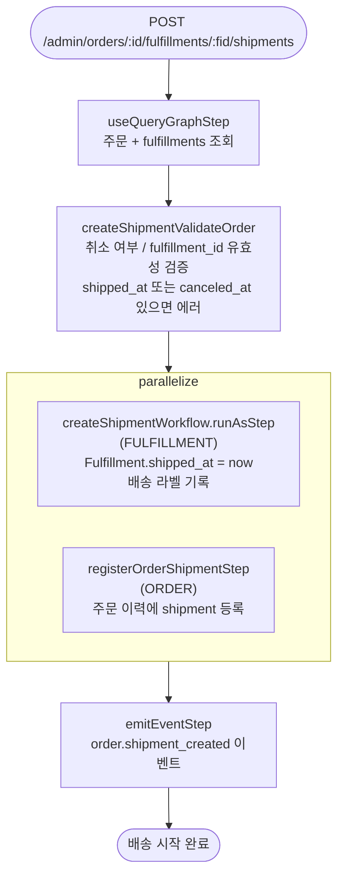

# createOrderShipmentWorkflow

관리자가 풀필먼트를 배송 시작 처리할 때 호출되는 워크플로우. `Fulfillment.shipped_at`을 설정하고 배송 라벨을 기록한다. 재고 수량은 변경하지 않는다.

[← 단계 README](./README.md)

**소스**: [packages/core/core-flows/src/order/workflows/create-shipment.ts](../../../../packages/core/core-flows/src/order/workflows/create-shipment.ts)
**호출 API**: `POST /admin/orders/:id/fulfillments/:fulfillment_id/shipments`

## 입력 / 출력

| 항목 | 타입 | 설명 |
|------|------|------|
| order_id | string | 주문 ID |
| fulfillment_id | string | 배송 처리할 Fulfillment ID |
| labels? | `{tracking_number, tracking_url, label_url}[]` | 배송 추적 라벨 |
| output | void | |

## Flowchart

## Step 설명

| 순번 | Step | 모듈 | 보상(rollback) |
|------|------|------|----------------|
| 1 | `useQueryGraphStep` | Query | 없음 |
| 2 | `createShipmentValidateOrder` | — | 없음 |
| 3a | `createShipmentWorkflow.runAsStep` | FULFILLMENT | `shipped_at = null`, 라벨 삭제 |
| 3b | `registerOrderShipmentStep` | ORDER | 이력 기록 롤백 |
| 4 | `emitEventStep` | EVENT_BUS | 없음 |

## 보상(Compensation) 흐름

- **`createShipmentWorkflow.runAsStep` 실패**: `shipped_at = null` 복원, 생성된 배송 라벨 삭제.
- **재고 변경 없음**: 재고 차감은 `createOrderFulfillmentWorkflow`에서 이미 완료된 상태.

## 호출하는 서브워크플로우

없음 (createShipmentWorkflow는 runAsStep으로 인라인 실행).
