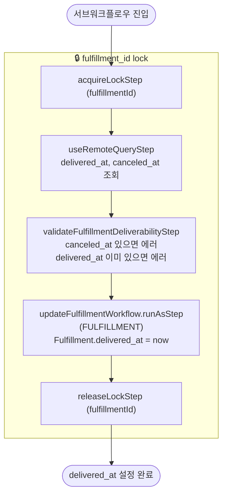

# markFulfillmentAsDeliveredWorkflow

Fulfillment에 `delivered_at`을 설정하는 내부 서브워크플로우. 풀필먼트 단위 락을 추가로 획득하여 중복 처리를 방지한다.

[← 단계 README](./README.md)

**소스**: [packages/core/core-flows/src/fulfillment/workflows/mark-fulfillment-as-delivered.ts](../../../../packages/core/core-flows/src/fulfillment/workflows/mark-fulfillment-as-delivered.ts)
**호출 API**: 직접 호출되지 않음 (markOrderFulfillmentAsDeliveredWorkflow에서 서브워크플로우로 호출)

## 입력 / 출력

| 항목 | 타입 | 설명 |
|------|------|------|
| fulfillment_id | string | Fulfillment ID |
| output | void | |

## Flowchart

## Step 설명

| 순번 | Step | 모듈 | 보상(rollback) |
|------|------|------|----------------|
| 1 | `acquireLockStep` (fulfillmentId) | LOCKING | `releaseLockStep` |
| 2 | `useRemoteQueryStep` | Remote Query | 없음 |
| 3 | `validateFulfillmentDeliverabilityStep` | — | 없음 |
| 4 | `updateFulfillmentWorkflow.runAsStep` | FULFILLMENT | `delivered_at = null` 복원 |
| 5 | `releaseLockStep` (fulfillmentId) | LOCKING | 없음 |

## 보상(Compensation) 흐름

- **`updateFulfillmentWorkflow.runAsStep` 실패**: `delivered_at = null`로 복원.
- 락은 항상 마지막에 `releaseLockStep`으로 해제.

## 호출하는 서브워크플로우

없음 (updateFulfillmentWorkflow는 runAsStep으로 인라인 실행).
