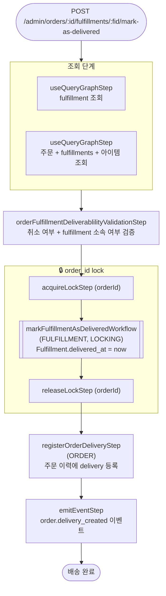

# markOrderFulfillmentAsDeliveredWorkflow

배송 완료를 확인하는 워크플로우. 주문과 풀필먼트에 이중 락을 걸고 `Fulfillment.delivered_at`을 설정한다.

[← 단계 README](./README.md)

**소스**: [packages/core/core-flows/src/order/workflows/mark-order-fulfillment-as-delivered.ts](../../../../packages/core/core-flows/src/order/workflows/mark-order-fulfillment-as-delivered.ts)
**호출 API**: `POST /admin/orders/:id/fulfillments/:fulfillment_id/mark-as-delivered`

## 입력 / 출력

| 항목 | 타입 | 설명 |
|------|------|------|
| order_id | string | 주문 ID |
| fulfillment_id | string | 배송 완료 처리할 Fulfillment ID |
| output | void | |

## Flowchart

## Step 설명

| 순번 | Step | 모듈 | 보상(rollback) |
|------|------|------|----------------|
| 1 | `useQueryGraphStep` (fulfillment) | Query | 없음 |
| 2 | `useQueryGraphStep` (order) | Query | 없음 |
| 3 | `orderFulfillmentDeliverablilityValidationStep` | — | 없음 |
| 4 | `acquireLockStep` (orderId) | LOCKING | `releaseLockStep` |
| 5 | `markFulfillmentAsDeliveredWorkflow` | FULFILLMENT, LOCKING | `delivered_at = null` 복원 |
| 6 | `releaseLockStep` (orderId) | LOCKING | 없음 |
| 7 | `registerOrderDeliveryStep` | ORDER | 이력 기록 롤백 |
| 8 | `emitEventStep` | EVENT_BUS | 없음 |

## 보상(Compensation) 흐름

- **`markFulfillmentAsDeliveredWorkflow` 실패**: `delivered_at = null`로 복원.
- 이중 락 구조: 주문 단위 락(`acquireLockStep orderId`) + 풀필먼트 단위 락(`markFulfillmentAsDeliveredWorkflow` 내부 `acquireLockStep fulfillmentId`)
- 재고 수량 변경 없음.

## 호출하는 서브워크플로우

- [markFulfillmentAsDeliveredWorkflow](./flow-markFulfillmentAsDeliveredWorkflow.md) — Fulfillment.delivered_at 설정 (풀필먼트 단위 내부 워크플로우)
