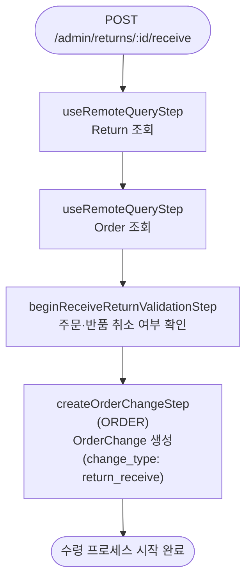

# beginReceiveReturnWorkflow

실물 수령 프로세스를 시작하는 워크플로우. `change_type: "return_receive"` 인 새 OrderChange를 생성한다. 이 워크플로우 이후에 `receiveItemReturnRequestWorkflow`로 개별 아이템을 수령 처리할 수 있다.

[← 단계 README](./README.md)

**소스**: [packages/core/core-flows/src/order/workflows/return/begin-receive-return.ts](../../../../packages/core/core-flows/src/order/workflows/return/begin-receive-return.ts)
**호출 API**: `POST /admin/returns/:id/receive`

## 입력 / 출력

| 항목 | 타입 | 설명 |
|------|------|------|
| return_id | string | Return ID |
| created_by? | string | 처리한 관리자 ID |
| description? | string | 수령 설명 |
| internal_note? | string | 내부 메모 |
| output | OrderChangeDTO | 생성된 OrderChange 객체 |

## Flowchart

## Step 설명

| 순번 | Step | 모듈 | 보상(rollback) |
|------|------|------|----------------|
| 1 | `useRemoteQueryStep` (Return) | Remote Query | 없음 |
| 2 | `useRemoteQueryStep` (Order) | Remote Query | 없음 |
| 3 | `beginReceiveReturnValidationStep` | — | 없음 |
| 4 | `createOrderChangeStep` | ORDER | OrderChange 삭제 |

## 보상(Compensation) 흐름

- **`createOrderChangeStep` 실패**: 생성된 OrderChange 삭제.

## 호출하는 서브워크플로우

없음.

## 참고

이 워크플로우는 수령 프로세스의 **시작** 만 담당한다. 실제 아이템 수령은 `receiveItemReturnRequestWorkflow`(`POST /admin/returns/:id/receive-items`)로 처리하고, 최종 확정은 `confirmReturnReceiveWorkflow`(`POST /admin/returns/:id/receive/confirm`)로 완료한다.
