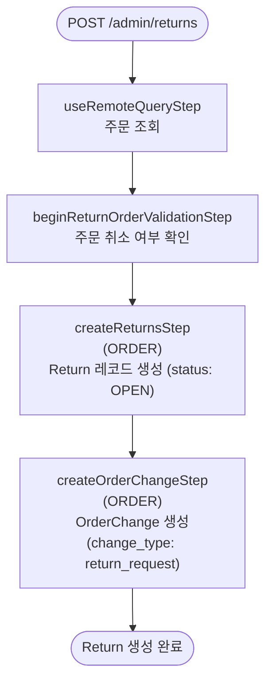

# beginReturnOrderWorkflow

관리자가 반품 절차를 시작할 때 호출되는 워크플로우. Return 레코드와 OrderChange를 생성하고 반품 요청 상태를 열린다.

[← 단계 README](./README.md)

**소스**: [packages/core/core-flows/src/order/workflows/return/begin-return.ts](../../../../packages/core/core-flows/src/order/workflows/return/begin-return.ts)
**호출 API**: `POST /admin/returns`

## 입력 / 출력

| 항목 | 타입 | 설명 |
|------|------|------|
| order_id | string | 반품 대상 주문 ID |
| created_by? | string | 생성한 관리자 ID |
| output | ReturnDTO | 생성된 Return 객체 |

## Flowchart

## Step 설명

| 순번 | Step | 모듈 | 보상(rollback) |
|------|------|------|----------------|
| 1 | `useRemoteQueryStep` | Remote Query | 없음 |
| 2 | `beginReturnOrderValidationStep` | — | 없음 |
| 3 | `createReturnsStep` | ORDER | Return 삭제 |
| 4 | `createOrderChangeStep` | ORDER | OrderChange 삭제 |

## 보상(Compensation) 흐름

- **`createReturnsStep` 실패**: 생성된 Return 레코드 삭제.
- **`createOrderChangeStep` 실패**: 생성된 OrderChange 삭제.

## 호출하는 서브워크플로우

없음.
