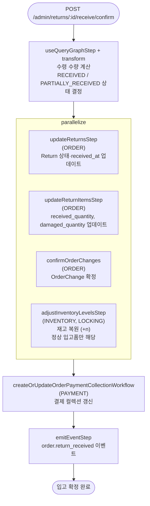

# confirmReturnReceiveWorkflow

반품 상품의 실물 입고를 확정하는 워크플로우. **이 단계에서 재고 복원이 발생한다.** 정상 수령품만 재고에 추가되고, 파손품은 수량만 기록한다.

[← 단계 README](./README.md)

**소스**: [packages/core/core-flows/src/order/workflows/return/confirm-receive-return-request.ts](../../../../packages/core/core-flows/src/order/workflows/return/confirm-receive-return-request.ts)
**호출 API**: `POST /admin/returns/:id/receive/confirm`

## 입력 / 출력

| 항목 | 타입 | 설명 |
|------|------|------|
| return_id | string | Return ID |
| items | `{id, quantity, damaged_quantity?}[]` | 수령한 아이템 목록 |
| output | void | |

## Flowchart

### 파손 입고 처리

| 입고 타입 | 재고 변동 | 기록 |
|----------|----------|------|
| 정상 입고 (`RECEIVE_RETURN_ITEM`) | `adjustInventoryLevelsStep` (+n) | `received_quantity` 증가 |
| 파손 입고 (`RECEIVE_DAMAGED_RETURN_ITEM`) | 재고 변동 없음 | `damaged_quantity` 증가 |

## Step 설명

| 순번 | Step | 모듈 | 보상(rollback) |
|------|------|------|----------------|
| 1 | `useQueryGraphStep` + transform | Query | 없음 |
| 2a | `updateReturnsStep` | ORDER | Return 상태 복원 |
| 2b | `updateReturnItemsStep` | ORDER | 수량 복원 |
| 2c | `confirmOrderChanges` | ORDER | OrderChange 롤백 |
| 2d | `adjustInventoryLevelsStep` | INVENTORY, LOCKING | 재고 재차감 (-n) |
| 3 | `createOrUpdateOrderPaymentCollectionWorkflow` | PAYMENT | 결제 컬렉션 복원 |
| 4 | `emitEventStep` | EVENT_BUS | 없음 |

## 보상(Compensation) 흐름

- **`adjustInventoryLevelsStep` 실패**: 복원한 재고를 재차감하여 원래 상태로 복원.

## 호출하는 서브워크플로우

없음.
