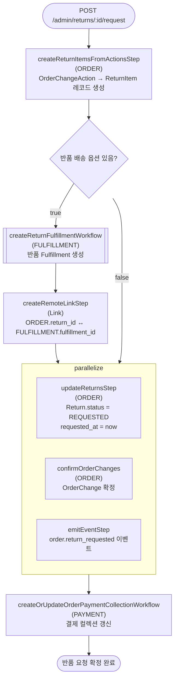

# confirmReturnRequestWorkflow

반품 요청을 확정하는 워크플로우. ReturnItem 레코드를 생성하고 반품 Fulfillment를 선택적으로 생성한다. OrderChange를 확정하여 Return 상태를 REQUESTED로 변경한다.

[← 단계 README](./README.md)

**소스**: [packages/core/core-flows/src/order/workflows/return/confirm-return-request.ts](../../../../packages/core/core-flows/src/order/workflows/return/confirm-return-request.ts)
**호출 API**: `POST /admin/returns/:id/request`

## 입력 / 출력

| 항목 | 타입 | 설명 |
|------|------|------|
| return_id | string | Return ID |
| output | void | |

## Flowchart

## Step 설명

| 순번 | Step | 모듈 | 보상(rollback) |
|------|------|------|----------------|
| 1 | `createReturnItemsFromActionsStep` | ORDER | ReturnItem 삭제 |
| 2 | `createReturnFulfillmentWorkflow` | FULFILLMENT | 생성된 Fulfillment 삭제 (조건부) |
| 3 | `createRemoteLinkStep` | Link | Remote Link 삭제 (조건부) |
| 4a | `updateReturnsStep` | ORDER | Return 상태 복원 |
| 4b | `confirmOrderChanges` | ORDER | OrderChange 롤백 |
| 4c | `emitEventStep` | EVENT_BUS | 없음 |
| 5 | `createOrUpdateOrderPaymentCollectionWorkflow` | PAYMENT | 결제 컬렉션 복원 |

## 보상(Compensation) 흐름

- **`createReturnItemsFromActionsStep` 실패**: 생성된 ReturnItem 삭제.
- **`createReturnFulfillmentWorkflow` 실패**: Fulfillment 레코드 삭제.

## 호출하는 서브워크플로우

- `createReturnFulfillmentWorkflow` — 반품 배송 Fulfillment 생성 (조건부)
