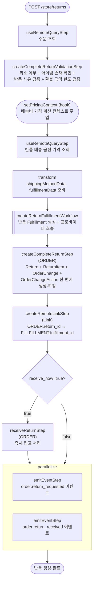

# createAndCompleteReturnOrderWorkflow

스토어프론트에서 고객이 직접 반품을 생성하고 한 번에 완료하는 워크플로우. 반품 Fulfillment 생성, Return 레코드 생성, 선택적 즉시 입고 처리를 한 번에 처리한다.

[← 단계 README](./README.md)

**소스**: [packages/core/core-flows/src/order/workflows/return/create-complete-return.ts](../../../../packages/core/core-flows/src/order/workflows/return/create-complete-return.ts)
**호출 API**: `POST /store/returns`

## 입력 / 출력

| 항목 | 타입 | 설명 |
|------|------|------|
| order_id | string | 반품 대상 주문 ID |
| items | `{id, quantity, reason_id?}[]` | 반품 아이템 목록 |
| return_shipping? | `{option_id, price?, labels?}` | 반품 배송 옵션 |
| location_id? | string | 반품 재고 위치 ID |
| receive_now? | boolean | true이면 즉시 입고 처리 |
| refund_amount? | number | 커스텀 환불 금액 |
| output | ReturnDTO | 생성된 Return 객체 |

## Flowchart

## Step 설명

| 순번 | Step | 모듈 | 보상(rollback) |
|------|------|------|----------------|
| 1 | `useRemoteQueryStep` | Remote Query | 없음 |
| 2 | `createCompleteReturnValidationStep` | — | 없음 |
| 3 | `setPricingContext` (hook) | — | 없음 |
| 4 | `useRemoteQueryStep` (배송 옵션) | Remote Query | 없음 |
| 5 | transform (데이터 준비) | — | 없음 |
| 6 | `createReturnFulfillmentWorkflow` | FULFILLMENT | Fulfillment 삭제 |
| 7 | `createCompleteReturnStep` | ORDER | Return/ReturnItem/OrderChange 삭제 |
| 8 | `createRemoteLinkStep` | Link | Remote Link 삭제 |
| 9 | `receiveReturnStep` | ORDER | 입고 기록 롤백 (조건부) |
| 10a | `emitEventStep` (return_requested) | EVENT_BUS | 없음 |
| 10b | `emitEventStep` (return_received) | EVENT_BUS | 없음 |

## 보상(Compensation) 흐름

- **`createReturnFulfillmentWorkflow` 실패**: 외부 프로바이더 호출 실패 시 Fulfillment 레코드 삭제.
- **`createCompleteReturnStep` 실패**: Return, ReturnItem, OrderChange 일괄 삭제.

## 호출하는 서브워크플로우

- `createReturnFulfillmentWorkflow` — 반품 배송 Fulfillment 생성
