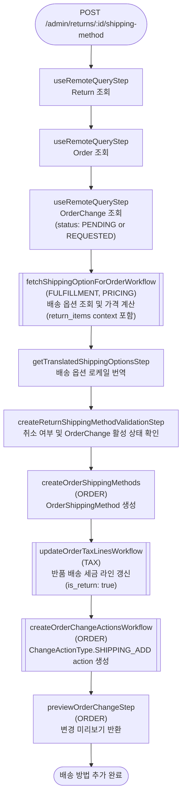

# createReturnShippingMethodWorkflow

반품에 배송 방법을 지정하는 워크플로우. 배송 옵션의 가격을 계산한 뒤 OrderShippingMethod를 생성하고, `SHIPPING_ADD` action을 OrderChange에 추가한다.

[← 단계 README](./README.md)

**소스**: [packages/core/core-flows/src/order/workflows/return/create-return-shipping-method.ts](../../../../packages/core/core-flows/src/order/workflows/return/create-return-shipping-method.ts)
**호출 API**: `POST /admin/returns/:id/shipping-method`

## 입력 / 출력

| 항목 | 타입 | 설명 |
|------|------|------|
| return_id | string | Return ID |
| shipping_option_id | string | 사용할 배송 옵션 ID |
| custom_amount? | BigNumberInput \| null | 배송비 수동 지정. 미지정 시 옵션 계산가 사용 |
| claim_id? | string | 연결된 클레임 ID |
| exchange_id? | string | 연결된 교환 ID |
| output | OrderPreviewDTO | 변경 미리보기 |

## Flowchart

## Step 설명

| 순번 | Step | 모듈 | 보상(rollback) |
|------|------|------|----------------|
| 1 | `useRemoteQueryStep` (Return) | Remote Query | 없음 |
| 2 | `useRemoteQueryStep` (Order) | Remote Query | 없음 |
| 3 | `useRemoteQueryStep` (OrderChange) | Remote Query | 없음 |
| 4 | `fetchShippingOptionForOrderWorkflow` | FULFILLMENT, PRICING | 없음 |
| 5 | `getTranslatedShippingOptionsStep` | — | 없음 |
| 6 | `createReturnShippingMethodValidationStep` | — | 없음 |
| 7 | `createOrderShippingMethods` | ORDER | OrderShippingMethod 삭제 |
| 8 | `updateOrderTaxLinesWorkflow` | TAX, CART | 없음 |
| 9 | `createOrderChangeActionsWorkflow` | ORDER | 생성된 action 삭제 |
| 10 | `previewOrderChangeStep` | ORDER | 없음 |

## 보상(Compensation) 흐름

- **`createOrderShippingMethods` 실패**: 생성된 OrderShippingMethod 삭제.
- **`createOrderChangeActionsWorkflow` 실패**: 생성된 `SHIPPING_ADD` action 삭제.

## 호출하는 서브워크플로우

| 워크플로우 | 목적 |
|-----------|------|
| `fetchShippingOptionForOrderWorkflow` | 배송 옵션 조회 및 가격 계산 |
| `updateOrderTaxLinesWorkflow` | 반품 배송에 대한 세금 라인 갱신 |
| `createOrderChangeActionsWorkflow` | `SHIPPING_ADD` action 생성 |
