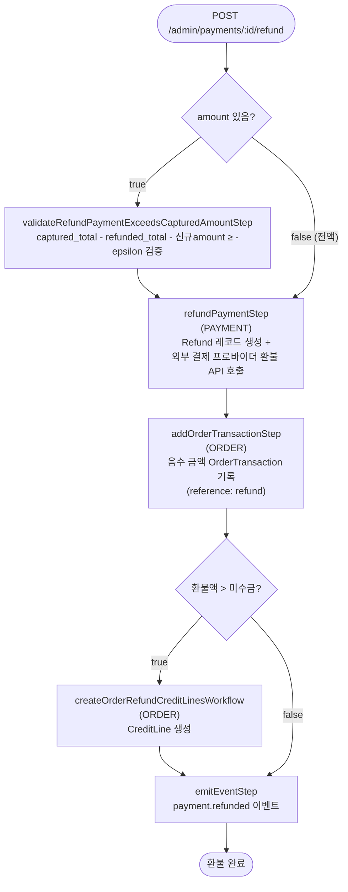

# refundPaymentWorkflow

단일 Payment에 대한 환불을 처리하는 워크플로우. 외부 결제 프로바이더에 환불 요청을 보내고 OrderTransaction에 음수 금액으로 기록한다.

[← 단계 README](./README.md)

**소스**: [packages/core/core-flows/src/payment/workflows/refund-payment.ts](../../../../packages/core/core-flows/src/payment/workflows/refund-payment.ts)
**호출 API**: `POST /admin/payments/:id/refund`

## 입력 / 출력

| 항목 | 타입 | 설명 |
|------|------|------|
| payment_id | string | 환불할 Payment ID |
| amount? | number | 환불 금액 (생략 시 전액) |
| note? | string | 환불 메모 |
| refund_reason_id? | string | 환불 사유 ID |
| output | RefundDTO | 생성된 Refund 객체 |

## Flowchart

### 부분환불 vs 전액환불

| 구분 | 처리 |
|------|------|
| 부분환불 | `amount` 지정 + `validateRefundPaymentExceedsCapturedAmountStep` 한도 검증 |
| 전액환불 | `amount` 생략 → 내부에서 `payment.amount` 전액 사용 |

## Step 설명

| 순번 | Step | 모듈 | 보상(rollback) |
|------|------|------|----------------|
| 1 | `validateRefundPaymentExceedsCapturedAmountStep` | — | 없음 (조건부) |
| 2 | `refundPaymentStep` | PAYMENT | 환불 취소 (가능한 경우) |
| 3 | `addOrderTransactionStep` | ORDER | OrderTransaction 삭제 |
| 4 | `createOrderRefundCreditLinesWorkflow` | ORDER | CreditLine 삭제 (조건부) |
| 5 | `emitEventStep` | EVENT_BUS | 없음 |

## 보상(Compensation) 흐름

- **`refundPaymentStep` 실패**: 외부 프로바이더 환불 API 호출 실패 시 에러 throw.
- 환불은 외부 시스템에 이미 반영된 경우 보상이 어려울 수 있으므로 결제 프로바이더 측 처리가 우선.

## 호출하는 서브워크플로우

없음.
