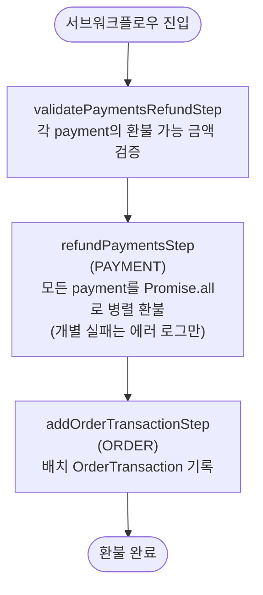

# refundPaymentsWorkflow

여러 Payment를 동시에 환불하는 워크플로우. 개별 환불 실패는 에러 로그만 남기고 나머지를 계속 처리한다.

[← 단계 README](./README.md)

**소스**: [packages/core/core-flows/src/payment/workflows/refund-payments.ts](../../../../packages/core/core-flows/src/payment/workflows/refund-payments.ts)
**호출 API**: 직접 호출되지 않음 (confirmReturnReceiveWorkflow 등에서 내부 호출)

## 입력 / 출력

| 항목 | 타입 | 설명 |
|------|------|------|
| transaction_id | string | OrderTransaction ID |
| payment_ids | string[] | 환불할 Payment ID 목록 |
| amount | number | 각 Payment에 환불할 금액 (필수) |
| output | void | |

## Flowchart

### refundPaymentWorkflow와의 차이

| 구분 | refundPaymentWorkflow | refundPaymentsWorkflow |
|------|---------------------|----------------------|
| 대상 | Payment 1개 | Payment 여러 개 |
| amount | 선택 (생략 시 전액) | 필수 |
| 실패 처리 | 즉시 에러 throw | 개별 실패 로그만 |
| 한도 검증 | `validateRefundPaymentExceedsCapturedAmountStep` | `validatePaymentsRefundStep` |

## Step 설명

| 순번 | Step | 모듈 | 보상(rollback) |
|------|------|------|----------------|
| 1 | `validatePaymentsRefundStep` | — | 없음 |
| 2 | `refundPaymentsStep` | PAYMENT | 없음 (개별 실패 로그) |
| 3 | `addOrderTransactionStep` | ORDER | OrderTransaction 삭제 |

## 보상(Compensation) 흐름

- 개별 Payment 환불 실패는 에러 로그만 남기고 나머지 처리를 계속한다.
- 전체 워크플로우 실패 시 OrderTransaction 삭제.

## 호출하는 서브워크플로우

없음.
