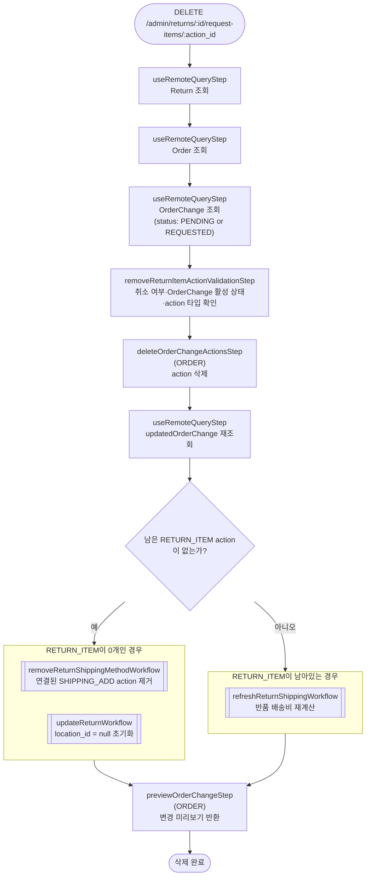

# removeItemReturnActionWorkflow

반품 요청에서 아이템 액션을 제거하는 워크플로우. 마지막 `RETURN_ITEM` action이 제거될 때는 연결된 배송 방법과 입고 위치도 함께 초기화된다.

[← 단계 README](./README.md)

**소스**: [packages/core/core-flows/src/order/workflows/return/remove-item-return-action.ts](../../../../packages/core/core-flows/src/order/workflows/return/remove-item-return-action.ts)
**호출 API**: `DELETE /admin/returns/:id/request-items/:action_id`

## 입력 / 출력

| 항목 | 타입 | 설명 |
|------|------|------|
| return_id | string | Return ID |
| action_id | string | 제거할 OrderChangeAction ID |
| output | OrderPreviewDTO | 변경 미리보기 |

## Flowchart

## Step 설명

| 순번 | Step | 모듈 | 보상(rollback) |
|------|------|------|----------------|
| 1 | `useRemoteQueryStep` (Return) | Remote Query | 없음 |
| 2 | `useRemoteQueryStep` (Order) | Remote Query | 없음 |
| 3 | `useRemoteQueryStep` (OrderChange) | Remote Query | 없음 |
| 4 | `removeReturnItemActionValidationStep` | — | 없음 |
| 5 | `deleteOrderChangeActionsStep` | ORDER | 없음 |
| 6 | `useRemoteQueryStep` (updatedOrderChange) | Remote Query | 없음 |
| 7a | (조건) `removeReturnShippingMethodWorkflow` | ORDER | 없음 |
| 7b | (조건) `updateReturnWorkflow` | ORDER | 없음 |
| 7c | (조건) `refreshReturnShippingWorkflow` | ORDER | 없음 |
| 8 | `previewOrderChangeStep` | ORDER | 없음 |

## 보상(Compensation) 흐름

보상 함수가 정의된 step이 없다.

## 호출하는 서브워크플로우

| 워크플로우 | 조건 | 목적 |
|-----------|------|------|
| `removeReturnShippingMethodWorkflow` | 남은 RETURN_ITEM action이 없을 때 | 연결된 배송 방법 제거 |
| `updateReturnWorkflow` | 남은 RETURN_ITEM action이 없을 때 | `location_id` null 초기화 |
| `refreshReturnShippingWorkflow` | RETURN_ITEM action이 남아있을 때 | 배송비 재계산 |
