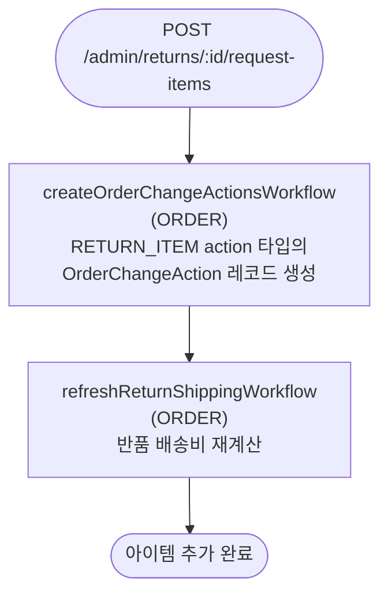

# requestItemReturnWorkflow

관리자가 반품할 아이템을 추가하는 워크플로우. 이 단계에서는 OrderChangeAction 레코드만 생성되고 실제 ReturnItem은 아직 생성되지 않는다.

[← 단계 README](./README.md)

**소스**: [packages/core/core-flows/src/order/workflows/return/request-item-return.ts](../../../../packages/core/core-flows/src/order/workflows/return/request-item-return.ts)
**호출 API**: `POST /admin/returns/:id/request-items`

## 입력 / 출력

| 항목 | 타입 | 설명 |
|------|------|------|
| return_id | string | Return ID |
| items | `{id, quantity, reason_id?}[]` | 반품 요청할 아이템 목록 |
| output | void | |

## Flowchart

## Step 설명

| 순번 | Step | 모듈 | 보상(rollback) |
|------|------|------|----------------|
| 1 | `createOrderChangeActionsWorkflow` | ORDER | 생성된 OrderChangeAction 삭제 |
| 2 | `refreshReturnShippingWorkflow` | ORDER | 없음 |

## 보상(Compensation) 흐름

- **`createOrderChangeActionsWorkflow` 실패**: 생성된 OrderChangeAction 레코드 삭제.
- 실제 ReturnItem은 `confirmReturnRequestWorkflow` 단계에서 생성된다.

## 호출하는 서브워크플로우

없음.
