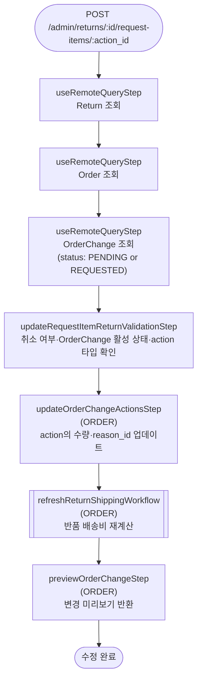

# updateRequestItemReturnWorkflow

이미 추가된 반품 아이템 액션의 수량·사유를 수정하는 워크플로우. 대상 action이 `RETURN_ITEM` 타입이어야 하며, OrderChange가 활성 상태여야 한다.

[← 단계 README](./README.md)

**소스**: [packages/core/core-flows/src/order/workflows/return/update-request-item-return.ts](../../../../packages/core/core-flows/src/order/workflows/return/update-request-item-return.ts)
**호출 API**: `POST /admin/returns/:id/request-items/:action_id`

## 입력 / 출력

| 항목 | 타입 | 설명 |
|------|------|------|
| return_id | string | Return ID |
| action_id | string | 수정할 OrderChangeAction ID |
| data.quantity? | number | 변경할 수량 |
| data.reason_id? | string \| null | 변경할 반품 사유 ID |
| data.internal_note? | string | 내부 메모 |
| output | OrderPreviewDTO | 변경 미리보기 |

## Flowchart

## Step 설명

| 순번 | Step | 모듈 | 보상(rollback) |
|------|------|------|----------------|
| 1 | `useRemoteQueryStep` (Return) | Remote Query | 없음 |
| 2 | `useRemoteQueryStep` (Order) | Remote Query | 없음 |
| 3 | `useRemoteQueryStep` (OrderChange) | Remote Query | 없음 |
| 4 | `updateRequestItemReturnValidationStep` | — | 없음 |
| 5 | `updateOrderChangeActionsStep` | ORDER | 없음 |
| 6 | `refreshReturnShippingWorkflow` | ORDER | 없음 |
| 7 | `previewOrderChangeStep` | ORDER | 없음 |

## 보상(Compensation) 흐름

보상 함수가 정의된 step이 없다.

## 호출하는 서브워크플로우

| 워크플로우 | 목적 |
|-----------|------|
| `refreshReturnShippingWorkflow` | 수량 변경 후 반품 배송비 재계산 |
