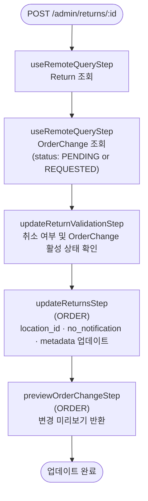

# updateReturnWorkflow

반품의 메타데이터·입고 위치·알림 설정을 업데이트하는 워크플로우. OrderChange가 PENDING 또는 REQUESTED 상태일 때만 실행 가능하다.

[← 단계 README](./README.md)

**소스**: [packages/core/core-flows/src/order/workflows/return/update-return.ts](../../../../packages/core/core-flows/src/order/workflows/return/update-return.ts)
**호출 API**: `POST /admin/returns/:id`

## 입력 / 출력

| 항목 | 타입 | 설명 |
|------|------|------|
| return_id | string | 업데이트할 Return ID |
| location_id? | string \| null | 반품 입고 위치 ID |
| no_notification? | boolean | 알림 발송 여부 |
| metadata? | Record\<string, unknown\> | 추가 메타데이터 |
| output | OrderPreviewDTO | 변경 미리보기 |

## Flowchart

## Step 설명

| 순번 | Step | 모듈 | 보상(rollback) |
|------|------|------|----------------|
| 1 | `useRemoteQueryStep` | Remote Query | 없음 |
| 2 | `useRemoteQueryStep` (OrderChange) | Remote Query | 없음 |
| 3 | `updateReturnValidationStep` | — | 없음 |
| 4 | `updateReturnsStep` | ORDER | 없음 |
| 5 | `previewOrderChangeStep` | ORDER | 없음 |

## 보상(Compensation) 흐름

보상 함수가 정의된 step이 없다. 업데이트 실패 시 이전 상태로 자동 복원되지 않으므로, 필요하면 재호출로 수동 정정해야 한다.

## 호출하는 서브워크플로우

없음.
