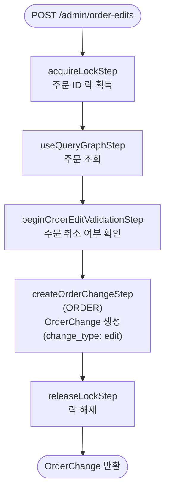

# beginOrderEditOrderWorkflow

관리자가 주문 편집 세션을 시작할 때 호출되는 워크플로우. `change_type: "edit"` 인 OrderChange를 생성하고 편집 세션을 연다.

[← 단계 README](./README.md)

**소스**: [packages/core/core-flows/src/order/workflows/order-edit/begin-order-edit.ts](../../../../packages/core/core-flows/src/order/workflows/order-edit/begin-order-edit.ts)  
**호출 API**: `POST /admin/order-edits`

## 입력 / 출력

| 항목 | 타입 | 설명 |
|------|------|------|
| order_id | string | 편집 대상 주문 ID |
| created_by? | string | 편집을 시작한 관리자 ID |
| description? | string | 편집 설명 |
| internal_note? | string | 내부 메모 |
| output | OrderChangeDTO | 생성된 OrderChange 객체 |

## Flowchart

## Step 설명

| 순번 | Step | 모듈 | 보상(rollback) |
|------|------|------|----------------|
| 1 | `acquireLockStep` | LOCKING | 자동 해제 |
| 2 | `useQueryGraphStep` | Remote Query | 없음 |
| 3 | `beginOrderEditValidationStep` | — | 없음 |
| 4 | `createOrderChangeStep` | ORDER | OrderChange 삭제 |
| 5 | `releaseLockStep` | LOCKING | 없음 |

## 보상(Compensation) 흐름

- **`createOrderChangeStep` 실패**: 생성된 OrderChange 삭제.

## 호출하는 서브워크플로우

없음.
