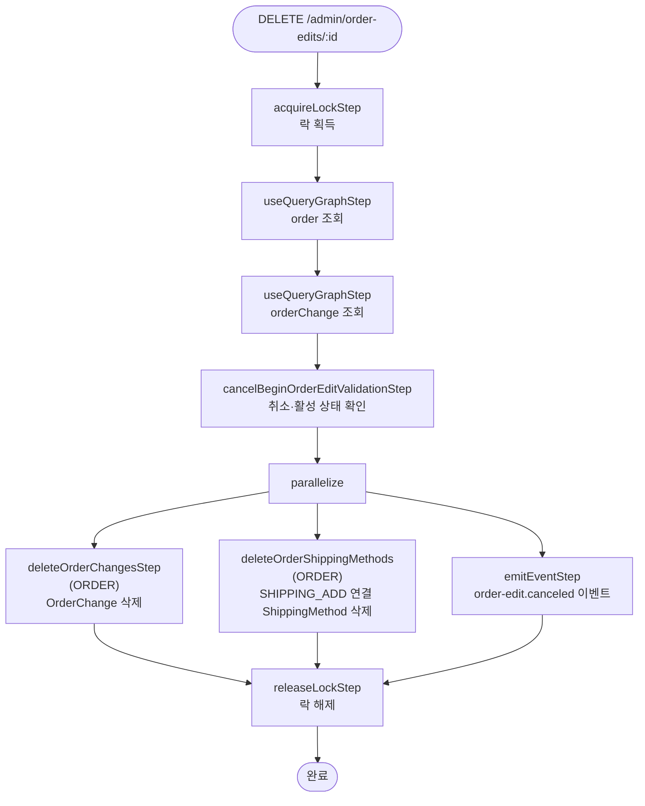

# cancelBeginOrderEditWorkflow

편집 세션 전체를 취소하는 워크플로우. OrderChange를 삭제하고 편집 세션에서 추가된 배송 방법을 제거한다.

[← 단계 README](./README.md)

**소스**: [packages/core/core-flows/src/order/workflows/order-edit/cancel-begin-order-edit.ts](../../../../packages/core/core-flows/src/order/workflows/order-edit/cancel-begin-order-edit.ts)  
**호출 API**: `DELETE /admin/order-edits/:id`

## 입력 / 출력

| 항목 | 타입 | 설명 |
|------|------|------|
| order_id | string | 편집 취소 대상 주문 ID |
| output | void | 반환값 없음 |

## Flowchart

## Step 설명

| 순번 | Step | 모듈 | 보상(rollback) |
|------|------|------|----------------|
| 1 | `acquireLockStep` | LOCKING | 자동 해제 |
| 2 | `useQueryGraphStep` (order) | Remote Query | 없음 |
| 3 | `useQueryGraphStep` (orderChange) | Remote Query | 없음 |
| 4 | `cancelBeginOrderEditValidationStep` | — | 없음 |
| 5 | `deleteOrderChangesStep` | ORDER | 없음 |
| 6 | `deleteOrderShippingMethods` | ORDER | 없음 |
| 7 | `emitEventStep` | — | 없음 |
| 8 | `releaseLockStep` | LOCKING | 없음 |

## 삭제 대상 ShippingMethod 결정

OrderChange actions 중 `action === ChangeActionType.SHIPPING_ADD`인 것의 `reference_id`(ShippingMethod ID)를 수집하여 삭제한다.

## 발행 이벤트

| 이벤트명 | 데이터 |
|---------|--------|
| `order-edit.canceled` | `{ order_id, actions }` |

## 호출하는 서브워크플로우

없음.
