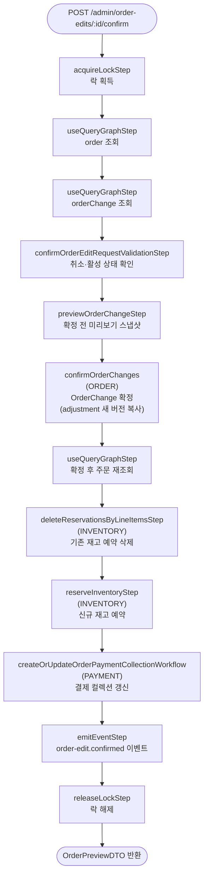

# confirmOrderEditRequestWorkflow

편집을 최종 확정하는 워크플로우. OrderChange가 적용되고 재고 예약이 갱신되며 결제 컬렉션이 업데이트된다.

[← 단계 README](./README.md)

**소스**: [packages/core/core-flows/src/order/workflows/order-edit/confirm-order-edit-request.ts](../../../../packages/core/core-flows/src/order/workflows/order-edit/confirm-order-edit-request.ts)  
**호출 API**: `POST /admin/order-edits/:id/confirm`

## 입력 / 출력

| 항목 | 타입 | 설명 |
|------|------|------|
| order_id | string | 편집 대상 주문 ID |
| confirmed_by? | string | 확정한 관리자 ID |
| output | OrderPreviewDTO | 확정 전 미리보기 스냅샷 |

## Flowchart

## Step 설명

| 순번 | Step | 모듈 | 보상(rollback) |
|------|------|------|----------------|
| 1 | `acquireLockStep` | LOCKING | 자동 해제 |
| 2 | `useQueryGraphStep` (order) | Remote Query | 없음 |
| 3 | `useQueryGraphStep` (orderChange) | Remote Query | 없음 |
| 4 | `confirmOrderEditRequestValidationStep` | — | 없음 |
| 5 | `previewOrderChangeStep` | ORDER | 없음 |
| 6 | `confirmOrderChanges` | ORDER | 없음 |
| 7 | `useQueryGraphStep` (refreshedOrder) | Remote Query | 없음 |
| 8 | `deleteReservationsByLineItemsStep` | INVENTORY | 없음 |
| 9 | `reserveInventoryStep` | INVENTORY | 예약 삭제 |
| 10 | `createOrUpdateOrderPaymentCollectionWorkflow` | PAYMENT | 없음 |
| 11 | `emitEventStep` | — | 없음 |
| 12 | `releaseLockStep` | LOCKING | 없음 |

## 재고 예약 갱신 로직

확정 전 미리보기(`orderPreview`)와 원주문 아이템 목록을 비교하여:
- **제거된 아이템** (`previousItemIds`에 있지만 `currentItemIds`에 없는 것): 재고 예약 삭제 대상
- **추가·수정된 아이템** (`ITEM_ADD` / `ITEM_UPDATE` action이 있는 것): 재고 예약 삭제 후 재생성

예약 수량은 `새 수량 - 이미 배송 완료된 수량`으로 계산한다.

## 발행 이벤트

| 이벤트명 | 데이터 |
|---------|--------|
| `order-edit.confirmed` | `{ order_id, actions }` |

## 호출하는 서브워크플로우

| 서브워크플로우 | 역할 |
|----------------|------|
| `createOrUpdateOrderPaymentCollectionWorkflow` | 결제 컬렉션 금액 갱신 (pending_difference 기준) |
