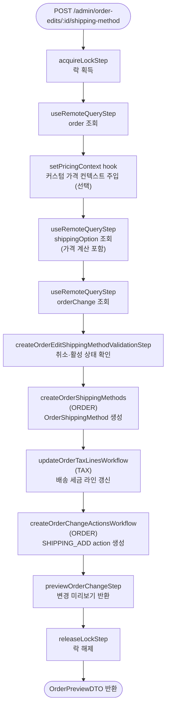

# createOrderEditShippingMethodWorkflow

편집 세션에 배송 방법을 추가하는 워크플로우. `SHIPPING_ADD` action을 생성하고 세금 라인을 갱신한다. `setPricingContext` hook으로 커스텀 가격 컨텍스트를 주입할 수 있다.

[← 단계 README](./README.md)

**소스**: [packages/core/core-flows/src/order/workflows/order-edit/create-order-edit-shipping-method.ts](../../../../packages/core/core-flows/src/order/workflows/order-edit/create-order-edit-shipping-method.ts)  
**호출 API**: `POST /admin/order-edits/:id/shipping-method`

## 입력 / 출력

| 항목 | 타입 | 설명 |
|------|------|------|
| order_id | string | 편집 대상 주문 ID |
| shipping_option_id | string | 사용할 배송 옵션 ID |
| custom_amount? | BigNumberInput | 커스텀 배송비 (미지정 시 배송 옵션 금액 사용) |
| output | OrderPreviewDTO | 변경 미리보기 |

## Flowchart

## Step 설명

| 순번 | Step | 모듈 | 보상(rollback) |
|------|------|------|----------------|
| 1 | `acquireLockStep` | LOCKING | 자동 해제 |
| 2 | `useRemoteQueryStep` (order) | Remote Query | 없음 |
| 3 | `setPricingContext` (hook) | — | 없음 |
| 4 | `useRemoteQueryStep` (shippingOption) | Remote Query | 없음 |
| 5 | `useRemoteQueryStep` (orderChange) | Remote Query | 없음 |
| 6 | `createOrderEditShippingMethodValidationStep` | — | 없음 |
| 7 | `createOrderShippingMethods` | ORDER | ShippingMethod 삭제 |
| 8 | `updateOrderTaxLinesWorkflow` | TAX | 없음 |
| 9 | `createOrderChangeActionsWorkflow` | ORDER | action 삭제 |
| 10 | `previewOrderChangeStep` | ORDER | 없음 |
| 11 | `releaseLockStep` | LOCKING | 없음 |

## 보상(Compensation) 흐름

- **`createOrderShippingMethods` 실패**: 생성된 ShippingMethod 삭제.
- **`createOrderChangeActionsWorkflow` 실패**: 생성된 SHIPPING_ADD action 삭제.

## 호출하는 서브워크플로우

| 서브워크플로우 | 역할 |
|----------------|------|
| `updateOrderTaxLinesWorkflow` | 배송 방법 세금 라인 갱신 |
| `createOrderChangeActionsWorkflow` | SHIPPING_ADD action 생성 |
