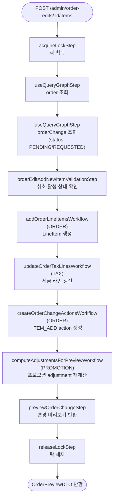

# orderEditAddNewItemWorkflow

편집 세션에 새 아이템을 추가하는 워크플로우. LineItem을 생성하고 `ITEM_ADD` action을 기록한다. 추가 후 프로모션 adjustment를 재계산한다.

[← 단계 README](./README.md)

**소스**: [packages/core/core-flows/src/order/workflows/order-edit/order-edit-add-new-item.ts](../../../../packages/core/core-flows/src/order/workflows/order-edit/order-edit-add-new-item.ts)  
**호출 API**: `POST /admin/order-edits/:id/items`

## 입력 / 출력

| 항목 | 타입 | 설명 |
|------|------|------|
| order_id | string | 편집 대상 주문 ID |
| items | array | 추가할 아이템 목록 (variant_id, quantity, unit_price 등) |
| output | OrderPreviewDTO | 변경 미리보기 |

## Flowchart

## Step 설명

| 순번 | Step | 모듈 | 보상(rollback) |
|------|------|------|----------------|
| 1 | `acquireLockStep` | LOCKING | 자동 해제 |
| 2 | `useQueryGraphStep` (order) | Remote Query | 없음 |
| 3 | `useQueryGraphStep` (orderChange) | Remote Query | 없음 |
| 4 | `orderEditAddNewItemValidationStep` | — | 없음 |
| 5 | `addOrderLineItemsWorkflow` | ORDER | LineItem 삭제 |
| 6 | `updateOrderTaxLinesWorkflow` | TAX | 없음 |
| 7 | `createOrderChangeActionsWorkflow` | ORDER | action 삭제 |
| 8 | `computeAdjustmentsForPreviewWorkflow` | PROMOTION | 없음 |
| 9 | `previewOrderChangeStep` | ORDER | 없음 |
| 10 | `releaseLockStep` | LOCKING | 없음 |

## 보상(Compensation) 흐름

- **`addOrderLineItemsWorkflow` 실패**: 생성된 LineItem 삭제.
- **`createOrderChangeActionsWorkflow` 실패**: 생성된 action 삭제.

## 호출하는 서브워크플로우

| 서브워크플로우 | 역할 |
|----------------|------|
| `addOrderLineItemsWorkflow` | LineItem DB 생성 |
| `updateOrderTaxLinesWorkflow` | 새 아이템 세금 라인 갱신 |
| `createOrderChangeActionsWorkflow` | ITEM_ADD action 생성 |
| `computeAdjustmentsForPreviewWorkflow` | 프로모션 조건 재평가 및 adjustment 재계산 |
