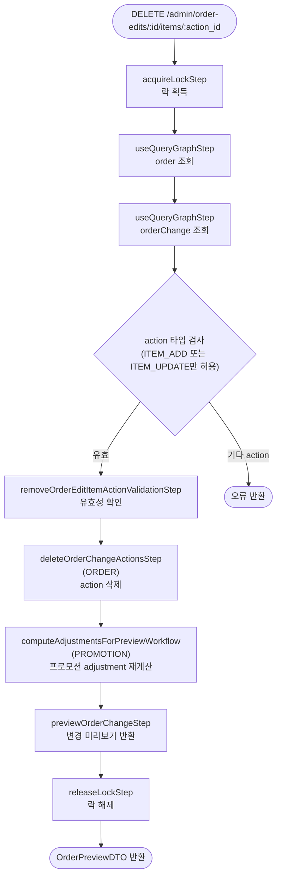

# removeItemOrderEditActionWorkflow

편집 세션 중 추가하거나 수정한 아이템 action을 되돌리는 워크플로우. `ITEM_ADD` 또는 `ITEM_UPDATE` action만 제거할 수 있으며, 원주문의 아이템을 직접 삭제하지 않는다.

[← 단계 README](./README.md)

**소스**: [packages/core/core-flows/src/order/workflows/order-edit/remove-order-edit-item-action.ts](../../../../packages/core/core-flows/src/order/workflows/order-edit/remove-order-edit-item-action.ts)  
**호출 API**: `DELETE /admin/order-edits/:id/items/:action_id`

## 입력 / 출력

| 항목 | 타입 | 설명 |
|------|------|------|
| order_id | string | 편집 대상 주문 ID |
| action_id | string | 제거할 OrderChangeAction ID |
| output | OrderPreviewDTO | 변경 미리보기 |

## Flowchart

## Step 설명

| 순번 | Step | 모듈 | 보상(rollback) |
|------|------|------|----------------|
| 1 | `acquireLockStep` | LOCKING | 자동 해제 |
| 2 | `useQueryGraphStep` (order) | Remote Query | 없음 |
| 3 | `useQueryGraphStep` (orderChange) | Remote Query | 없음 |
| 4 | `removeOrderEditItemActionValidationStep` | — | 없음 |
| 5 | `deleteOrderChangeActionsStep` | ORDER | 없음 |
| 6 | `computeAdjustmentsForPreviewWorkflow` | PROMOTION | 없음 |
| 7 | `previewOrderChangeStep` | ORDER | 없음 |
| 8 | `releaseLockStep` | LOCKING | 없음 |

## 제약 조건

- 제거 대상 action이 `ITEM_ADD` 또는 `ITEM_UPDATE`가 아니면 오류가 발생한다.
- 원주문에 있던 아이템을 제거하려면 `orderEditUpdateItemQuantityWorkflow`에서 `quantity: 0`을 사용한다.

## 호출하는 서브워크플로우

| 서브워크플로우 | 역할 |
|----------------|------|
| `computeAdjustmentsForPreviewWorkflow` | 프로모션 조건 재평가 및 adjustment 재계산 |
