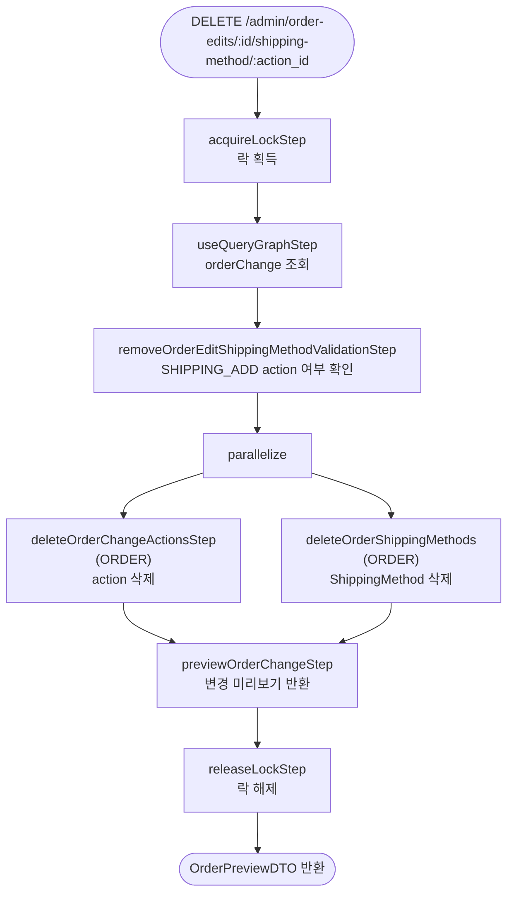

# removeOrderEditShippingMethodWorkflow

편집 세션에서 배송 방법을 제거하는 워크플로우. `SHIPPING_ADD` action과 연결된 OrderShippingMethod를 함께 삭제한다.

[← 단계 README](./README.md)

**소스**: [packages/core/core-flows/src/order/workflows/order-edit/remove-order-edit-shipping-method.ts](../../../../packages/core/core-flows/src/order/workflows/order-edit/remove-order-edit-shipping-method.ts)  
**호출 API**: `DELETE /admin/order-edits/:id/shipping-method/:action_id`

## 입력 / 출력

| 항목 | 타입 | 설명 |
|------|------|------|
| order_id | string | 편집 대상 주문 ID |
| action_id | string | 제거할 SHIPPING_ADD action ID |
| output | OrderPreviewDTO | 변경 미리보기 |

## Flowchart

## Step 설명

| 순번 | Step | 모듈 | 보상(rollback) |
|------|------|------|----------------|
| 1 | `acquireLockStep` | LOCKING | 자동 해제 |
| 2 | `useQueryGraphStep` (orderChange) | Remote Query | 없음 |
| 3 | `removeOrderEditShippingMethodValidationStep` | — | 없음 |
| 4 | `deleteOrderChangeActionsStep` | ORDER | 없음 |
| 5 | `deleteOrderShippingMethods` | ORDER | 없음 |
| 6 | `previewOrderChangeStep` | ORDER | 없음 |
| 7 | `releaseLockStep` | LOCKING | 없음 |

## 제약 조건

- 제거 대상 action이 `SHIPPING_ADD`가 아니면 오류가 발생한다.

## 호출하는 서브워크플로우

없음.
