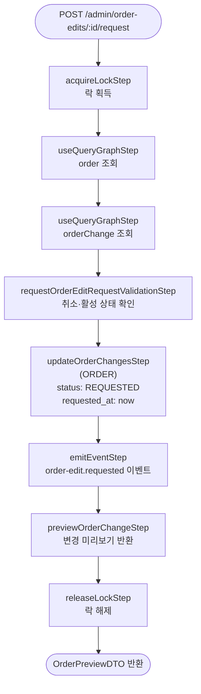

# requestOrderEditRequestWorkflow

편집 내용을 확정 대기 상태로 전환하는 워크플로우. OrderChange 상태를 `PENDING → REQUESTED`로 변경하고 이벤트를 발행한다.

[← 단계 README](./README.md)

**소스**: [packages/core/core-flows/src/order/workflows/order-edit/request-order-edit.ts](../../../../packages/core/core-flows/src/order/workflows/order-edit/request-order-edit.ts)  
**호출 API**: `POST /admin/order-edits/:id/request`

## 입력 / 출력

| 항목 | 타입 | 설명 |
|------|------|------|
| order_id | string | 편집 대상 주문 ID |
| requested_by? | string | 요청한 관리자 ID |
| output | OrderPreviewDTO | 변경 미리보기 |

## Flowchart

## Step 설명

| 순번 | Step | 모듈 | 보상(rollback) |
|------|------|------|----------------|
| 1 | `acquireLockStep` | LOCKING | 자동 해제 |
| 2 | `useQueryGraphStep` (order) | Remote Query | 없음 |
| 3 | `useQueryGraphStep` (orderChange) | Remote Query | 없음 |
| 4 | `requestOrderEditRequestValidationStep` | — | 없음 |
| 5 | `updateOrderChangesStep` | ORDER | 없음 |
| 6 | `emitEventStep` | — | 없음 |
| 7 | `previewOrderChangeStep` | ORDER | 없음 |
| 8 | `releaseLockStep` | LOCKING | 없음 |

## 발행 이벤트

| 이벤트명 | 데이터 |
|---------|--------|
| `order-edit.requested` | `{ order_id, actions }` |

## 호출하는 서브워크플로우

없음.
