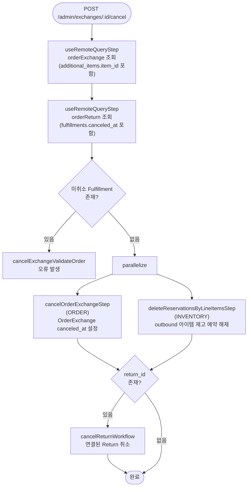

# cancelOrderExchangeWorkflow

확정된 교환을 취소하는 워크플로우. 연결된 Return도 함께 취소되며, outbound 아이템의 재고 예약이 해제된다. 취소 전 모든 Fulfillment가 먼저 취소되어 있어야 한다.

[← 단계 README](./README.md)

**소스**: [packages/core/core-flows/src/order/workflows/exchange/cancel-exchange.ts](../../../../packages/core/core-flows/src/order/workflows/exchange/cancel-exchange.ts)  
**호출 API**: `POST /admin/exchanges/:id/cancel`

## 입력 / 출력

| 항목 | 타입 | 설명 |
|------|------|------|
| exchange_id | string | 취소할 교환 ID |
| canceled_by? | string | 취소한 관리자 ID |
| no_notification? | boolean | 알림 발송 여부 |
| output | void | 반환값 없음 |

## Flowchart

## Step 설명

| 순번 | Step | 모듈 | 보상(rollback) |
|------|------|------|----------------|
| 1 | `useRemoteQueryStep` (orderExchange) | Remote Query | 없음 |
| 2 | `useRemoteQueryStep` (orderReturn) | Remote Query | 없음 |
| 3 | `cancelExchangeValidateOrder` | — | 없음 |
| 4 | `cancelOrderExchangeStep` | ORDER | 없음 |
| 5 | `deleteReservationsByLineItemsStep` | INVENTORY | 없음 |
| 6 | (조건) `cancelReturnWorkflow` | ORDER | 없음 |

## 취소 전 조건

- 교환과 연결된 Fulfillment가 모두 취소(`canceled_at` 설정)되어 있어야 한다. 그렇지 않으면 `"All fulfillments must be canceled before canceling an exchange"` 오류가 발생한다.

## 호출하는 서브워크플로우

| 서브워크플로우 | 역할 |
|----------------|------|
| `cancelReturnWorkflow` | 교환에 연결된 Return 취소 (return_id 존재 시에만) |
