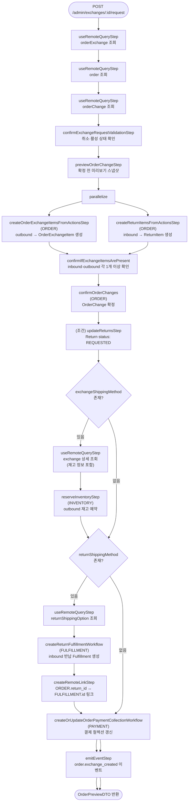

# confirmExchangeRequestWorkflow

교환을 최종 확정하는 워크플로우. inbound 아이템은 ReturnItem으로, outbound 아이템은 OrderExchangeItem으로 확정된다. outbound 재고 예약, inbound 반납 Fulfillment 생성, 결제 컬렉션 갱신이 이루어진다.

[← 단계 README](./README.md)

**소스**: [packages/core/core-flows/src/order/workflows/exchange/confirm-exchange-request.ts](../../../../packages/core/core-flows/src/order/workflows/exchange/confirm-exchange-request.ts)  
**호출 API**: `POST /admin/exchanges/:id/request`

## 입력 / 출력

| 항목 | 타입 | 설명 |
|------|------|------|
| exchange_id | string | 확정할 교환 ID |
| confirmed_by? | string | 확정한 관리자 ID |
| output | OrderPreviewDTO | 확정 전 미리보기 스냅샷 |

## Flowchart

## Step 설명

| 순번 | Step | 모듈 | 보상(rollback) |
|------|------|------|----------------|
| 1 | `useRemoteQueryStep` (×3) | Remote Query | 없음 |
| 2 | `confirmExchangeRequestValidationStep` | — | 없음 |
| 3 | `previewOrderChangeStep` | ORDER | 없음 |
| 4 | `createOrderExchangeItemsFromActionsStep` | ORDER | 없음 |
| 5 | `createReturnItemsFromActionsStep` | ORDER | 없음 |
| 6 | `confirmIfExchangeItemsArePresent` | — | 없음 |
| 7 | `confirmOrderChanges` | ORDER | 없음 |
| 8 | (조건) `updateReturnsStep` | ORDER | 없음 |
| 9 | (조건) `reserveInventoryStep` | INVENTORY | 예약 삭제 |
| 10 | (조건) `createReturnFulfillmentWorkflow` | FULFILLMENT | Fulfillment 취소 |
| 11 | (조건) `createRemoteLinkStep` | Link | 링크 삭제 |
| 12 | `createOrUpdateOrderPaymentCollectionWorkflow` | PAYMENT | 없음 |
| 13 | `emitEventStep` | — | 없음 |

## 확정 전 검증

- inbound(`RETURN_ITEM` action)와 outbound(`ITEM_ADD` action)가 각각 1개 이상 없으면 오류가 발생한다.

## 조건부 실행

| 조건 | 실행 내용 |
|------|-----------|
| outbound 배송 방법 존재 | outbound 아이템 재고 예약 |
| inbound 배송 방법 존재 | 반납 Fulfillment 생성 + Remote Link |

## 발행 이벤트

| 이벤트명 | 데이터 |
|---------|--------|
| `order.exchange_created` | `{ order_id, exchange_id }` |

## 호출하는 서브워크플로우

| 서브워크플로우 | 역할 |
|----------------|------|
| `createReturnFulfillmentWorkflow` | inbound 반납 배송 Fulfillment 생성 |
| `createOrUpdateOrderPaymentCollectionWorkflow` | 결제 컬렉션 금액 갱신 |
