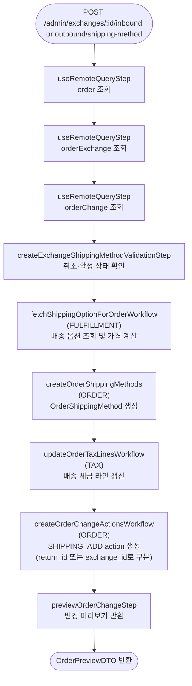

# createExchangeShippingMethodWorkflow

교환의 inbound(반납) 또는 outbound(신규 발송) 배송 방법을 추가하는 워크플로우. 동일 워크플로우를 inbound·outbound 각각 호출하며, `SHIPPING_ADD` action에 `return_id` 또는 `exchange_id`로 구분한다.

[← 단계 README](./README.md)

**소스**: [packages/core/core-flows/src/order/workflows/exchange/create-exchange-shipping-method.ts](../../../../packages/core/core-flows/src/order/workflows/exchange/create-exchange-shipping-method.ts)  
**호출 API**:
- `POST /admin/exchanges/:id/inbound/shipping-method` (반납 배송)
- `POST /admin/exchanges/:id/outbound/shipping-method` (신규 발송)

## 입력 / 출력

| 항목 | 타입 | 설명 |
|------|------|------|
| exchange_id | string | 교환 ID |
| shipping_option_id | string | 사용할 배송 옵션 ID |
| custom_amount? | BigNumberInput | 커스텀 배송비 |
| return_id? | string | 반납 배송의 경우 Return ID (inbound 구분자) |
| output | OrderPreviewDTO | 변경 미리보기 |

## Flowchart

## Step 설명

| 순번 | Step | 모듈 | 보상(rollback) |
|------|------|------|----------------|
| 1 | `useRemoteQueryStep` (order) | Remote Query | 없음 |
| 2 | `useRemoteQueryStep` (orderExchange) | Remote Query | 없음 |
| 3 | `useRemoteQueryStep` (orderChange) | Remote Query | 없음 |
| 4 | `createExchangeShippingMethodValidationStep` | — | 없음 |
| 5 | `fetchShippingOptionForOrderWorkflow` | FULFILLMENT | 없음 |
| 6 | `createOrderShippingMethods` | ORDER | ShippingMethod 삭제 |
| 7 | `updateOrderTaxLinesWorkflow` | TAX | 없음 |
| 8 | `createOrderChangeActionsWorkflow` | ORDER | action 삭제 |
| 9 | `previewOrderChangeStep` | ORDER | 없음 |

## inbound / outbound 구분

`SHIPPING_ADD` action에 기록되는 필드로 구분:
- **inbound(반납)**: `return_id` 필드에 Return ID 기록
- **outbound(신규 발송)**: `exchange_id` 필드에 Exchange ID 기록

`confirmExchangeRequestWorkflow`에서 `extractShippingOption` 함수가 이 필드로 returnShippingMethod와 exchangeShippingMethod를 분리한다.

## 호출하는 서브워크플로우

| 서브워크플로우 | 역할 |
|----------------|------|
| `fetchShippingOptionForOrderWorkflow` | 배송 옵션 가격 계산 |
| `updateOrderTaxLinesWorkflow` | 배송 방법 세금 라인 갱신 |
| `createOrderChangeActionsWorkflow` | SHIPPING_ADD action 생성 |
