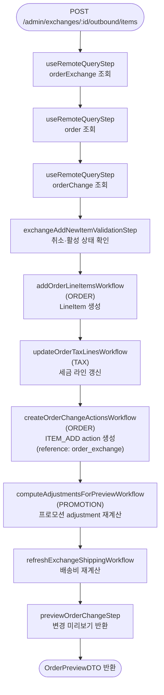

# orderExchangeAddNewItemWorkflow

교환에서 고객에게 새로 발송할 outbound 아이템을 추가하는 워크플로우. `ITEM_ADD` action을 기록하고 프로모션 adjustment를 재계산한다.

[← 단계 README](./README.md)

**소스**: [packages/core/core-flows/src/order/workflows/exchange/exchange-add-new-item.ts](../../../../packages/core/core-flows/src/order/workflows/exchange/exchange-add-new-item.ts)  
**호출 API**: `POST /admin/exchanges/:id/outbound/items`

## 입력 / 출력

| 항목 | 타입 | 설명 |
|------|------|------|
| exchange_id | string | 교환 ID |
| items | array | 발송할 아이템 목록 (variant_id, quantity 등) |
| output | OrderPreviewDTO | 변경 미리보기 |

## Flowchart

## Step 설명

| 순번 | Step | 모듈 | 보상(rollback) |
|------|------|------|----------------|
| 1 | `useRemoteQueryStep` (orderExchange) | Remote Query | 없음 |
| 2 | `useRemoteQueryStep` (order) | Remote Query | 없음 |
| 3 | `useRemoteQueryStep` (orderChange) | Remote Query | 없음 |
| 4 | `exchangeAddNewItemValidationStep` | — | 없음 |
| 5 | `addOrderLineItemsWorkflow` | ORDER | LineItem 삭제 |
| 6 | `updateOrderTaxLinesWorkflow` | TAX | 없음 |
| 7 | `createOrderChangeActionsWorkflow` | ORDER | action 삭제 |
| 8 | `computeAdjustmentsForPreviewWorkflow` | PROMOTION | 없음 |
| 9 | `refreshExchangeShippingWorkflow` | ORDER | 없음 |
| 10 | `previewOrderChangeStep` | ORDER | 없음 |

## Order Edit과의 차이

Order Edit의 `ITEM_ADD` action과 달리, 교환의 `ITEM_ADD` action에는 `reference: "order_exchange"`, `reference_id: orderExchange.id`가 추가로 기록된다. 이를 통해 확정 시 `createOrderExchangeItemsFromActionsStep`이 해당 action들을 OrderExchangeItem으로 변환한다.

## 호출하는 서브워크플로우

| 서브워크플로우 | 역할 |
|----------------|------|
| `addOrderLineItemsWorkflow` | LineItem DB 생성 |
| `updateOrderTaxLinesWorkflow` | 새 아이템 세금 라인 갱신 |
| `createOrderChangeActionsWorkflow` | ITEM_ADD action 생성 |
| `computeAdjustmentsForPreviewWorkflow` | 프로모션 조건 재평가 및 adjustment 재계산 |
| `refreshExchangeShippingWorkflow` | outbound 아이템 기반 배송비 재계산 |
