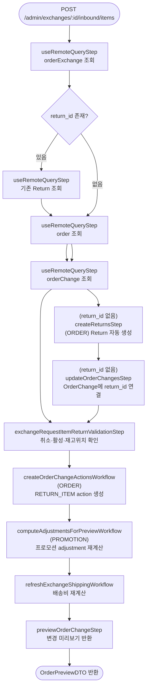

# orderExchangeRequestItemReturnWorkflow

교환에서 반납(inbound)할 아이템을 지정하는 워크플로우. Return 레코드가 없으면 자동 생성하고 `RETURN_ITEM` action을 기록한다. 이후 프로모션 adjustment를 재계산한다.

[← 단계 README](./README.md)

**소스**: [packages/core/core-flows/src/order/workflows/exchange/exchange-request-item-return.ts](../../../../packages/core/core-flows/src/order/workflows/exchange/exchange-request-item-return.ts)  
**호출 API**: `POST /admin/exchanges/:id/inbound/items`

## 입력 / 출력

| 항목 | 타입 | 설명 |
|------|------|------|
| exchange_id | string | 교환 ID |
| items | array | 반납할 아이템 목록 (id, quantity, reason_id 등) |
| location_id? | string | 반납 위치 ID (미지정 시 아이템의 첫 번째 재고 위치 사용) |
| output | OrderPreviewDTO | 변경 미리보기 |

## Flowchart

## Step 설명

| 순번 | Step | 모듈 | 보상(rollback) |
|------|------|------|----------------|
| 1 | `useRemoteQueryStep` (orderExchange) | Remote Query | 없음 |
| 2 | (조건) `useRemoteQueryStep` (return) | Remote Query | 없음 |
| 3 | `useRemoteQueryStep` (order) | Remote Query | 없음 |
| 4 | `useRemoteQueryStep` (orderChange) | Remote Query | 없음 |
| 5 | (조건) `createReturnsStep` | ORDER | Return 삭제 |
| 6 | (조건) `updateOrderChangesStep` | ORDER | 없음 |
| 7 | `exchangeRequestItemReturnValidationStep` | — | 없음 |
| 8 | (조건) `updateOrderExchangesStep` | ORDER | 없음 |
| 9 | `createOrderChangeActionsWorkflow` | ORDER | action 삭제 |
| 10 | `computeAdjustmentsForPreviewWorkflow` | PROMOTION | 없음 |
| 11 | `refreshExchangeShippingWorkflow` | ORDER | 없음 |
| 12 | `previewOrderChangeStep` | ORDER | 없음 |

## 반납 위치 결정 로직

`input.location_id`가 지정되지 않은 경우, 반납 대상 아이템의 variant → inventory_items → inventory → location_levels 를 순회하여 첫 번째 `location_id`를 사용한다.

## 호출하는 서브워크플로우

| 서브워크플로우 | 역할 |
|----------------|------|
| `createOrderChangeActionsWorkflow` | RETURN_ITEM action 생성 |
| `computeAdjustmentsForPreviewWorkflow` | 프로모션 조건 재평가 및 adjustment 재계산 |
| `refreshExchangeShippingWorkflow` | 반납 아이템 기반 배송비 재계산 |
